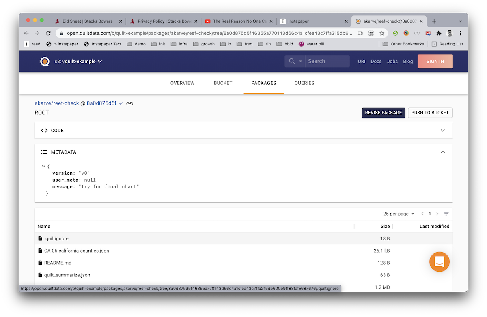
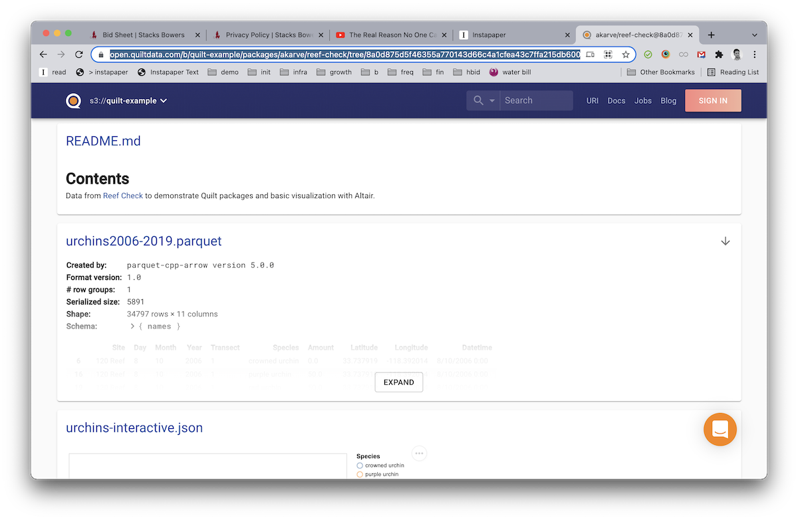

# Git-like operations for datasets and Jupyter notebooks

`quilt3` provides a simple command-line for versioning large datasets and storing
them in Amazon S3. There are only two commands you need to know:
* `push` creates a new package revision in an S3 bucket that you designate
* `install` downloads data from a remote package to disk


## Why not use Git?
In short, neither Git nor Git LFS have the capacity or performance to function
as a repository for data. S3, on the other hand, is widely used, fast, supports
versioning, and currently stores some trillions of data objects.

Similar concerns apply when baking datasets into Docker containers: images bloat
and slow container operations down.

## Pre-requisites
You will need either an AWS account, credentials, and an S3 bucket,
OR a Quilt enterprise stack with at least one bucket. In order to read from and
write to S3 with `quilt3`, you must first do one of the following:

* [Configure your AWS credentials](https://docs.aws.amazon.com/cli/latest/userguide/cli-configure-files.html)
* OR, if and only if your company runs a Quilt enterprise stack, run the following:
   ```bash
   pip install quilt3
   quilt3 config https://yourquilt.yourcompany.com
   quilt3 login
   ```

## Install a package
A Quilt package contains any collection of data (usually as files), metadata, and
documentation that you specify.

Let's get a data package from S3 and write it `quilt-hurdat/data` .
```bash
mkdir reef-check
cd reef-check
quilt3 install \
    "akarve/reef-check" \
    --registry s3://quilt-example \
    --dest .
```

Now you've got data in the current working directory.
```
ls
CA-06-california-counties.json	quilt_summarize.json  urchins-interactive.json
README.md			reef-check.ipynb      urchins2006-2019.parquet
```

## Creating your first package
Now let's imagine that we've modified this data locally.
We save our Jupyter notebook and push the results back to Quilt:
```bash
# Be sure to substitute YOUR_NAME and YOUR_BUCKET with the desired strings
quilt3 push \
    YOUR_NAME/reef-check \
    --dir . \
    --registry s3://YOUR_BUCKET \
    --message "Initial commit of reef data"
```

Quilt will then print out something like the following:
```bash
Package YOUR_NAME/reef-check@ea334b7 pushed to s3://YOUR_BUCKET
Successfully pushed the new package to https://yourquilt.yourocmpany.com/b/YOUR_NAME/packages/akarve/reef-check
```
## List the packages in a bucket
```bash
quilt3 list-packages s3://YOUR_BUCKET
```

In the Quilt catalog, you will now see a new package revision, complete with
a README, data grid preview, and an interactive visualization in Altair.




You can see an example of this package live
[here](https://open.quiltdata.com/b/quilt-example/packages/akarve/reef-check/tree/8a0d875d5f46355a770143d66c4a1cfea43c7ffa215db600b9ff88fafe687676/).

## Learn more
Those are the basics of reading and writing Quilt packages with the
CLI. See the [CLI reference](../api-reference/cli.md) for more.
