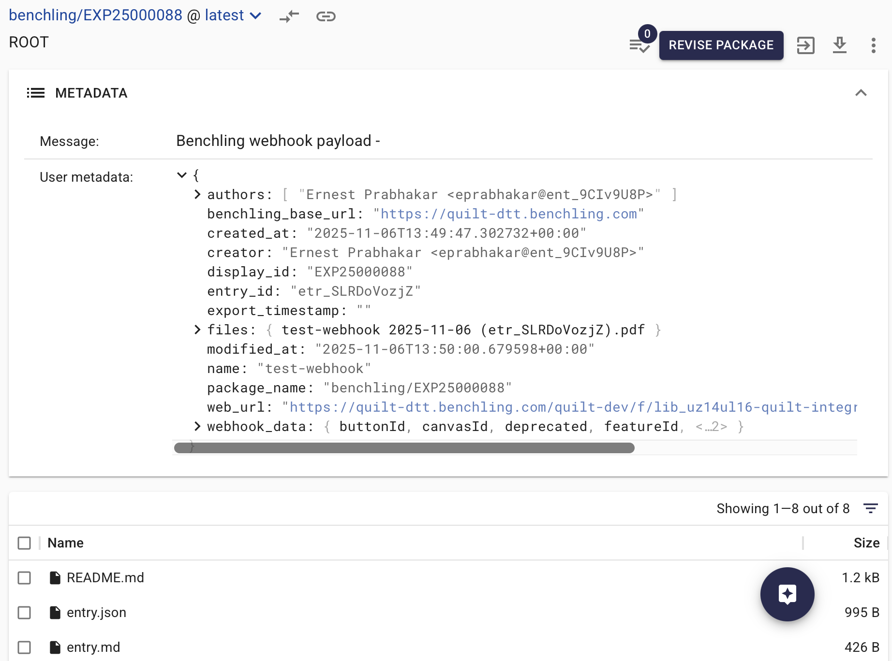
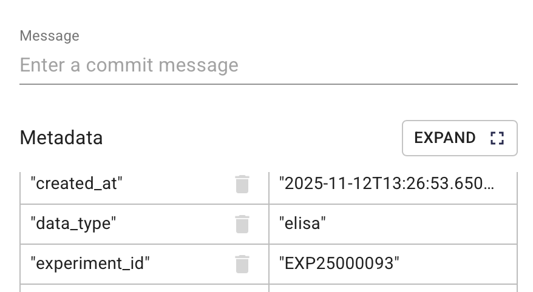
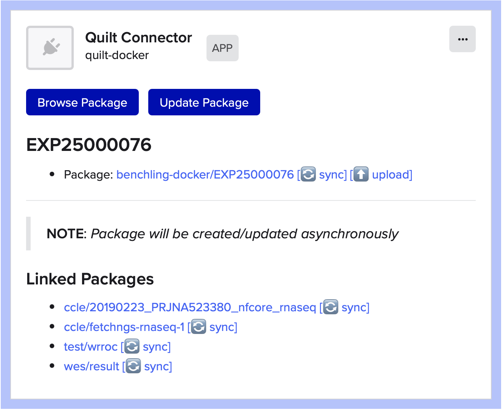
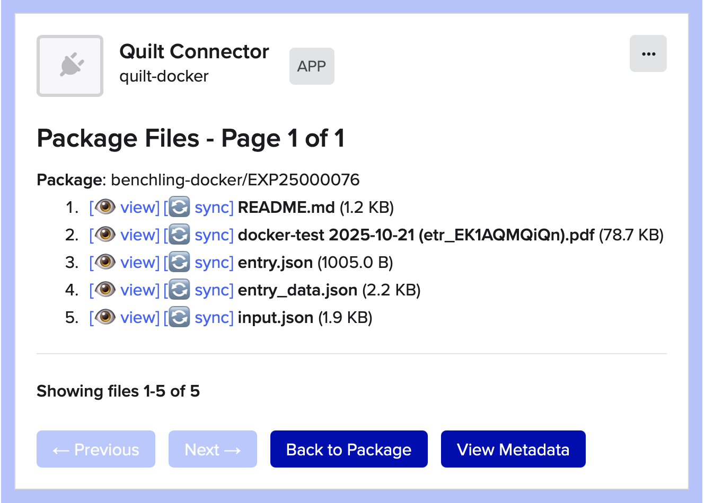
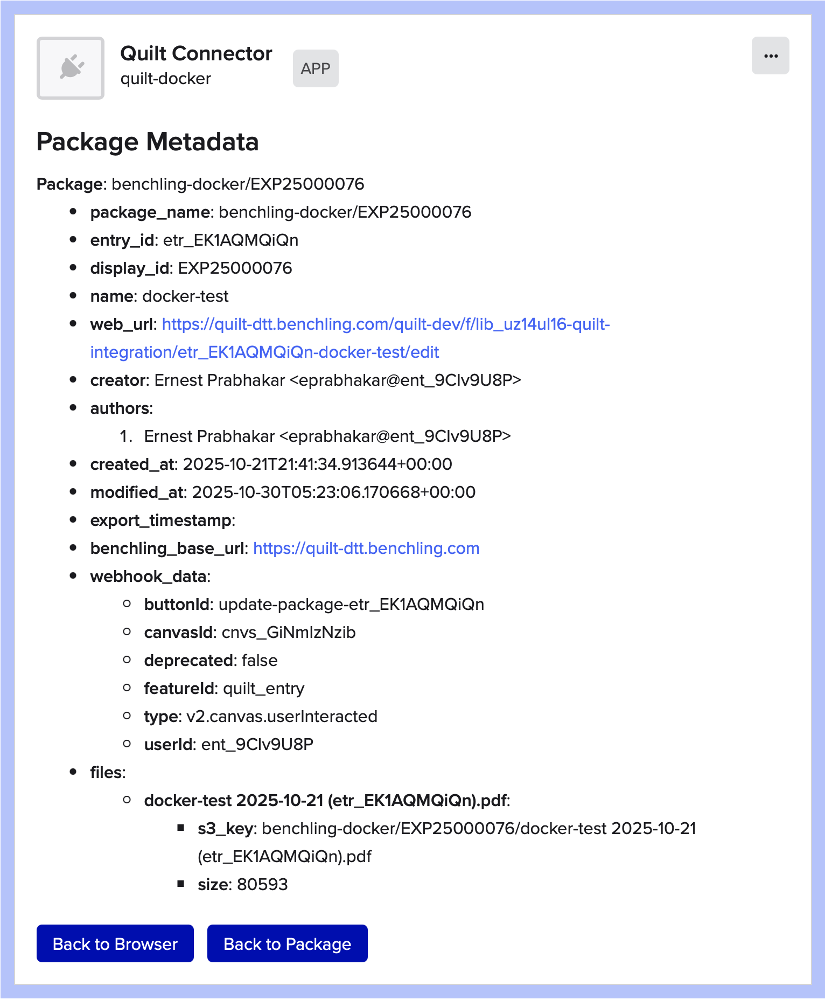
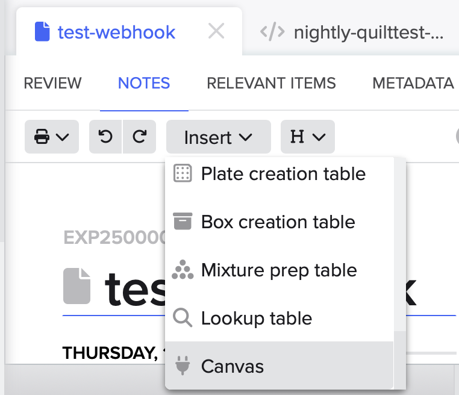

# Benchling Webhook Integration for Quilt

The Benchling Webhook creates a seamless connection between
[Benchling](https://www.benchling.com)'s Electronic Lab Notebook (ELN) and
[Quilt](https://www.quilt.bio)'s Scientific Data Management System (SDMS) for
Amazon S3.
It not only allows you to view Benchling metadata and attachments inside Quilt
packages, but also enables users to browse Quilt package descriptions from
inside Benchling notebooks.

The webhook works through a
[Benchling App](https://docs.benchling.com/docs/getting-started-benchling-apps)
that must be installed in your Organization by a Benchling Administrator and
configured to call your stack's unique webhook (see Installation, below).

## Availability

It is available in the Quilt Platform (1.65 or later) or as a standalone CDK
stack via the `@quiltdata/benchling-webhook`
[npm package](https://www.npmjs.com/package/@quiltdata/benchling-webhook).

## Functionality

### Auto-Packaging



When scientists create notebook entries in Benchling, this webhook
automatically:

- **Creates a dedicated Quilt package** for each notebook entry
- **Synchronizes metadata** from Benchling (experiment IDs, authors, etc.)
  into that package
- **Copies attachments** from that notebook into Amazon S3 as part of the
  package.
- **Enables organizational data discovery** by making contents available in
  ElasticSearch, and metadata available in Amazon Athena.

### Package Linking



In addition, Quilt users can 'tag' additional packages by setting the
`experiment_id` (or a custom metadata key) to the display ID of a Benchling
notebook, e.g., `EXP00001234`.

From inside the Quilt Catalog:

1. Navigate to the package of interest
2. Click 'Revise Package'
3. Go the metadata editor in the bottom left
4. In the bottom row, enter `experiment_id` as key and the display ID as the
   value.
5. Set the commit message and click 'Save'

### Benchling App Canvas



The webhook includes a Benchling App Canvas, which allows Benchling users to
view, browse, and sync the associated Quilt packages.

- Clicking the package name opens it in the Quilt Catalog
- The `sync` button will open the package or file in
  [QuiltSync](https://www.quilt.bio/quiltsync), if you have it installed.
- The `Update` button refreshes the package, as Benchling only notifies Quilt
  of changes when the metadata fields are modified.

The canvas also allows you to browse package contents:



and view package metadata:



#### Inserting a Canvas

If the App Canvas is not already part of your standard notebook template,
Benchling users can add it themselves:

1. Create a notebook entry
2. Select "Insert" → "Canvas"
3. Choose "Quilt Package"
4. After it is inserted, click the "Create" button



## Installation

### 1. Installing the Benchling App

This requires a Benchling admin to use `npx` from
[NodeJS](https://nodejs.org) version 18 or later.

#### 1.1 Generate a manifest

```bash
npx @quiltdata/benchling-webhook@latest manifest
```

This will generate an `app-manifest.yaml` file in your local folder

#### 1.2 Upload the manifest to Benchling

Follow Benchling's [create][create-app] and [install][install-app]
instructions.
Save the **App Definition ID**, **Client ID**, and **Client Secret** for the
next step.

[create-app]: https://docs.benchling.com/docs/getting-started-benchling-apps#creating-an-app-from-a-manifest
[install-app]: https://docs.benchling.com/docs/getting-started-benchling-apps#installing-your-app

### 2. Configuring the Benchling App

Your command-line environment must have AWS credentials for the account
containing your Quilt stack.
All you need to do is use `npx` to run the package:

```bash
npx @quiltdata/benchling-webhook@latest
```

The wizard will guide you through:

1. **Catalog discovery** - Detect your Quilt catalog configuration
2. **Stack validation** - Extract settings from your CloudFormation stack
3. **Credential collection** - Enter Benchling app credentials
4. **Deployment mode selection**:
   - **Integrated**: Uses your Quilt stack's built-in webhook, if any
   - **Standalone**: Deploys a separate webhook stack for testing

**Note**: Configuration is stored in `~/.config/benchling-webhook/` using the
[XDG Base Directory](https://wiki.archlinux.org/title/XDG_Base_Directory)
standard, supporting multiple profiles.

### 3. Configure Webhook URL

Add the webhook URL (displayed after setup) to your [Benchling app
settings][app-settings].

[app-settings]: https://docs.benchling.com/docs/getting-started-benchling-apps#installing-your-app

### 4. Test Integration

In Benchling:

1. Create a notebook entry
2. Insert Canvas → Select "Quilt Package"
3. Click "Create"

A Quilt package will be automatically created and linked to your notebook
entry.
If you run into problems, contact [Quilt Support](mailto:support@quilt.bio)
