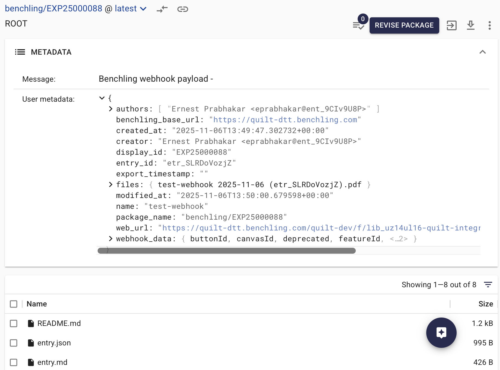
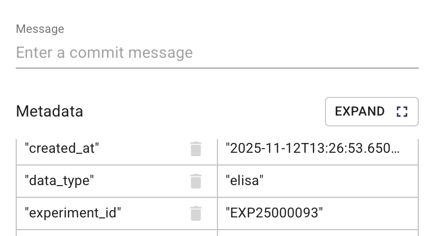
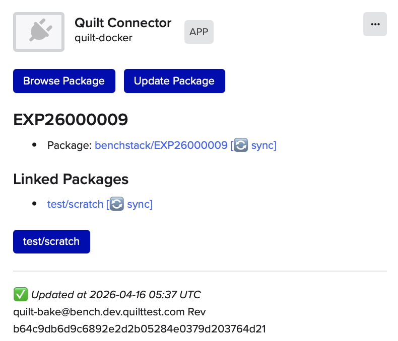
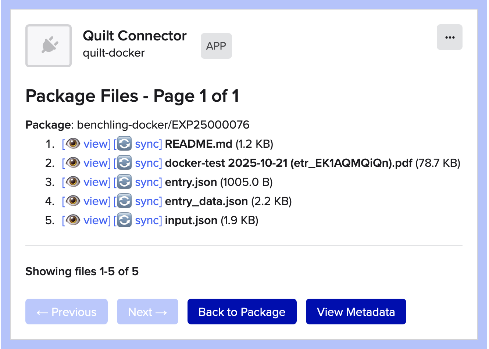
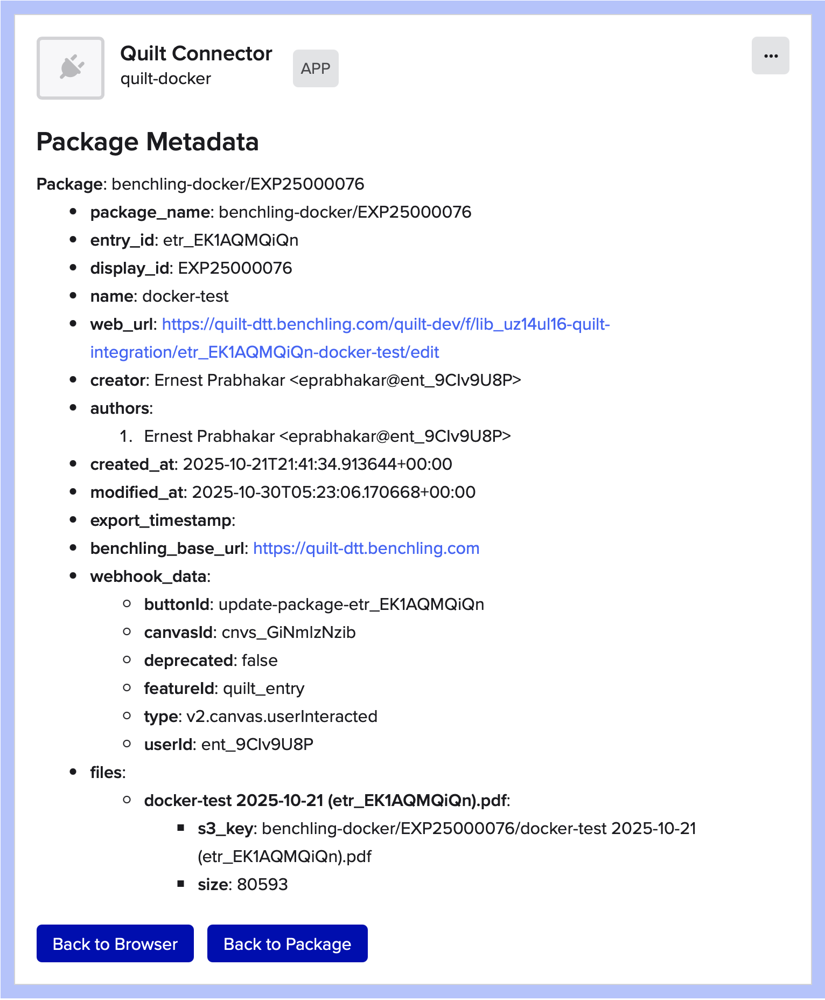
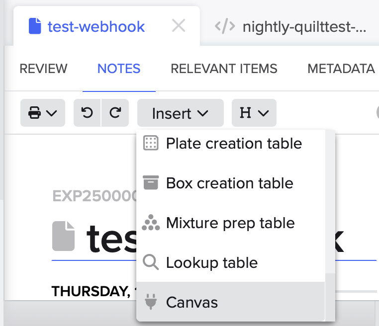
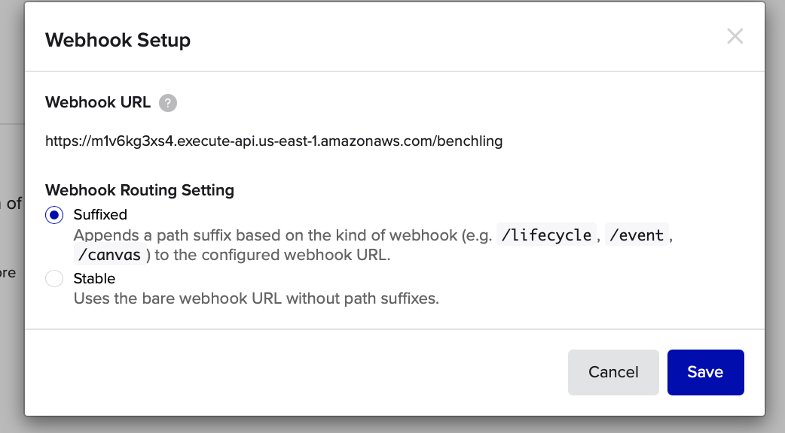

# Benchling Webhook Integration for Quilt

The Benchling Webhook creates a seamless connection between
[Benchling](https://www.benchling.com)'s Electronic Lab Notebook (ELN) and
[Quilt](https://www.quilt.bio)'s Scientific Data Management System (SDMS) for
Amazon S3.
It not only allows you to view Benchling metadata and attachments inside Quilt
packages, but also enables users to browse Quilt package descriptions from
inside Benchling notebooks.

The webhook works through a
[Benchling App](https://docs.benchling.com/docs/getting-started-benchling-apps)
that must be installed in your Organization by a Benchling Administrator and
configured to call your stack's unique webhook (see Installation, below).

## Availability

It is available in the Quilt Platform (1.65 or later; Referenced Entities and
bucketless deployments require 1.71.0 or later) or as a standalone CDK stack via
the `@quiltdata/benchling-webhook`
[npm package](https://www.npmjs.com/package/@quiltdata/benchling-webhook).

## Functionality

### Auto-Packaging



When scientists create notebook entries in Benchling, this webhook
automatically:

- **Creates a dedicated Quilt package** for each notebook entry
- **Synchronizes metadata** from Benchling into that package, e.g.:
  - `authors` (list)
  - `created_at` (ISO timestamp)
  - `creator` (e.g. `"First Last <user_id@ent_XXXX>"`)
  - `display_id` (e.g. `"EXP0000XXXXXX"`)
  - `entry_id` (e.g. `"etr_XXXXXX"`)
  - `files` (list)
  - `links` (list of referenced Benchling objects — see
    [Referenced Entities](#referenced-entities))
  - `modified_at` (ISO timestamp)
  - `web_url` (URL string)
- **Copies attachments** from that notebook into Amazon S3 as part of the
  package.
- **Enables organizational data discovery** by making contents available in
  ElasticSearch, and metadata available in Amazon Athena.

### Bucketless Deployments

[Auto-Packaging](#auto-packaging) writes each entry's package to a configured
**package bucket**. That bucket is now **optional** — you can run the webhook
without one. This suits organizations that link Benchling entries to Quilt
packages spread across many buckets rather than a single dedicated one.

When no package bucket is configured:

- **Setup omits the bucket.** The configuration wizard and secret creation no
  longer require a package bucket, so you can stand up the integration without
  dedicating one.
- **No default package is auto-created.** Entry and canvas events skip per-entry
  package creation and instead surface the Quilt packages that already reference
  the entry.
- **Discovery spans every bucket.** Linked-package search runs across all Quilt
  package-view buckets in the stack (via Amazon Athena) instead of a single
  bucket, and the source bucket is preserved when you browse a linked package's
  files or metadata from a Benchling canvas.

> **Note:** Requires Quilt Platform 1.71.0 or later (or standalone
> benchling-webhook v0.19.0 or later).

### Referenced Entities

When packaging a notebook entry, the webhook also discovers the Benchling
objects that entry references — custom entities, sequences, results tables,
and so on — and makes them **searchable by their human-readable name**. This
answers questions like *"show me every experiment that referenced QB-2743.1."*

The package metadata gains a `links` array, one object per referenced entity,
each with four fields:

```json
[
  {
    "type": "custom_entity",
    "id": "bfi_xCUXNVyG",
    "name": "QB-2743.1",
    "slug": "qb-2743-1"
  }
]
```

- **`type`** and **`id`** identify the referenced object.
- **`name`** is the authoritative Benchling display name, resolved via the
  Benchling API. It is the field you search on. It is `null` when the app
  lacks registry access for that object or the object type is unsupported.
- **`slug`** is a lossy token parsed from the object's URL, shown for
  reference only — it is **never** treated as a name or matched by name
  search.

To find packages that reference a given entity, search the Quilt Catalog for
its name (e.g. `QB-2743.1`); matches are scoped to `links.name`.

The raw discovery is also written to a `links.json` file in each package for
auditing and reprocessing.

> **Note:** This requires Quilt Platform 1.71.0 or later (or standalone
> benchling-webhook v0.18.0 or later). It is distinct from the manual
> [Package Linking](#package-linking) below, which tags packages by
> `experiment_id`.

### Package Linking



In addition, Quilt users can 'tag' additional packages by setting the
`experiment_id` (or a custom metadata key) to the display ID of a Benchling
notebook, e.g., `EXP00001234`.

From inside the Quilt Catalog:

1. Navigate to the package of interest
2. Click 'Revise Package'
3. Go the metadata editor in the bottom left
4. In the bottom row, enter `experiment_id` as key and the display ID as the
   value.
5. Set the commit message and click 'Save'

### Benchling App Canvas


The webhook includes a Benchling App Canvas, which allows Benchling users to
view, browse, and sync the associated Quilt packages.

- Clicking the package name opens it in the Quilt Catalog
- The `sync` button will open the package or file in
  [QuiltSync](https://www.quilt.bio/quiltsync), if you have it installed.
- The `Update` button manually refreshes the package. The canvas stays
  browsable while Quilt re-exports in the background, showing a "pending"
  badge that flips to "complete" when the new revision is ready.
- Package updates also happen automatically: any metadata change to the
  linked entry triggers a refresh, as does a Benchling `reviewRecord` event
  (e.g. when a notebook entry is submitted for review).



The canvas also allows you to browse package contents:



and view package metadata:



#### Inserting a Canvas

If the App Canvas is not already part of your standard notebook template,
Benchling users can add it themselves:

1. Create a notebook entry
2. Select "Insert" → "Canvas"
3. Choose "Quilt Package"
4. After it is inserted, click the "Create" button



## Installation

### 1. Installing the Benchling App

This requires a Benchling admin to use `npx` from
[NodeJS](https://nodejs.org) version 18 or later.

#### 1.1 Generate a manifest

```bash
npx @quiltdata/benchling-webhook@latest manifest
```

This will generate an `app-manifest.yaml` file in your local folder

#### 1.2 Upload the manifest to Benchling

Follow Benchling's [create][create-app] and [install][install-app]
instructions.
Save the **App Definition ID**, **Client ID**, and **Client Secret** for the
next step.

[create-app]: https://docs.benchling.com/docs/getting-started-benchling-apps#creating-an-app-from-a-manifest
[install-app]: https://docs.benchling.com/docs/getting-started-benchling-apps#installing-your-app

### 2. Configuring the Benchling App

Your command-line environment must have AWS credentials for the account
containing your Quilt stack.
All you need to do is use `npx` to run the package:

```bash
npx @quiltdata/benchling-webhook@latest
```

The wizard will guide you through:

1. **Catalog discovery** - Detect your Quilt catalog configuration
2. **Stack validation** - Extract settings from your CloudFormation stack
3. **Credential collection** - Enter Benchling app credentials
4. **Deployment mode selection**:
   - **Integrated**: Uses your Quilt stack's built-in webhook, if any
   - **Standalone**: Deploys a separate webhook stack for testing

**Note**: Configuration is stored in `~/.config/benchling-webhook/` using the
[XDG Base Directory](https://wiki.archlinux.org/title/XDG_Base_Directory)
standard, supporting multiple profiles.

### 3. Configure Webhook URL

Add the webhook URL (displayed after setup) to your [Benchling app
settings][app-settings].

[app-settings]: https://docs.benchling.com/docs/getting-started-benchling-apps#installing-your-app

In the Benchling **Webhook Setup** dialog, set **Webhook Routing Setting** to
**Suffixed**. Benchling then appends a path suffix based on the kind of event
(`/lifecycle`, `/event`, or `/canvas`) to your configured webhook URL, which is
what the Quilt webhook expects.



> **Important:** Do **not** select **Stable**. It posts every event to the bare
> webhook URL with no suffix, which the Quilt webhook does not handle — requests
> return `404 Endpoint not found`.

### 4. Test Integration

In Benchling:

1. Create a notebook entry
2. Insert Canvas → Select "Quilt Package"
3. Click "Create"

A Quilt package will be automatically created and linked to your notebook
entry.
If you run into problems, contact [Quilt Support](mailto:support@quilt.bio)

## Package Bucket (Optional)

As of Quilt Platform 1.71.0, a dedicated Benchling package bucket is optional.

- **With a dedicated bucket**, Benchling entry packages live in that bucket (the
  traditional setup).
- **Without one**, linked-package search on entry canvases spans all of your
  package-view buckets via a single Iceberg query.

When no dedicated bucket is configured, the Benchling task role is wired for
cross-bucket, Iceberg-backed search: it receives a `QUILT_ICEBERG_DATABASE`
environment variable, read-only Glue and S3 permissions, and a Lake Formation
grant on the Iceberg database. Stack admins auditing IAM or Lake Formation
permissions should expect these grants.
