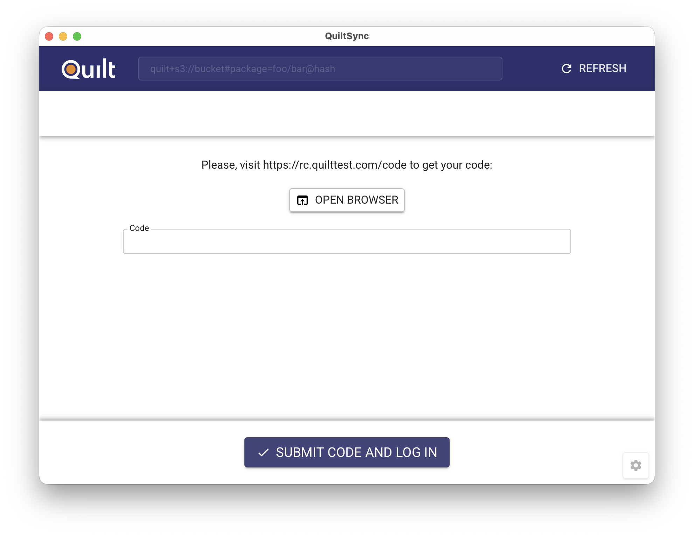
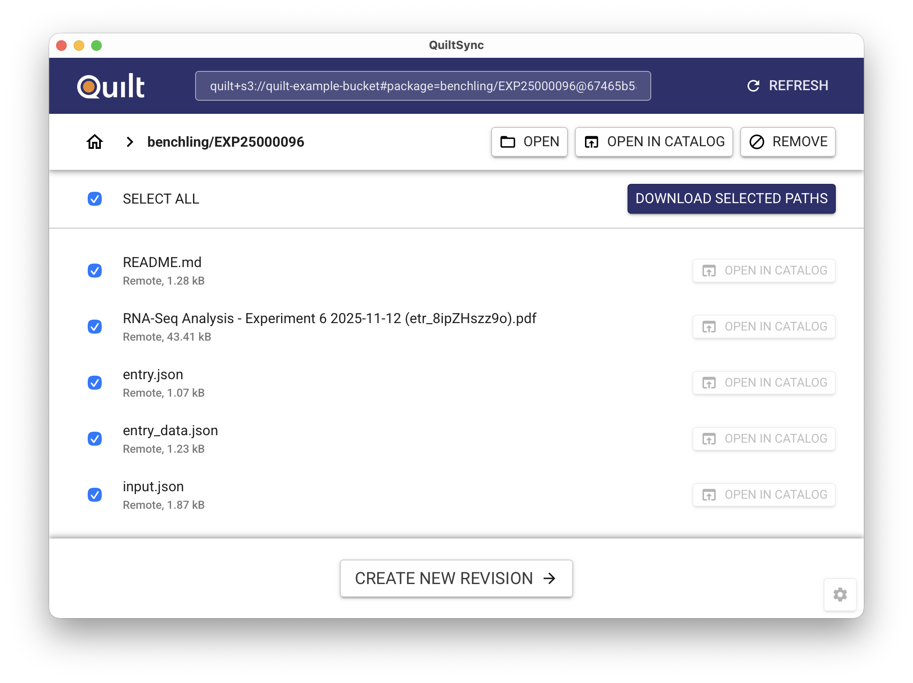
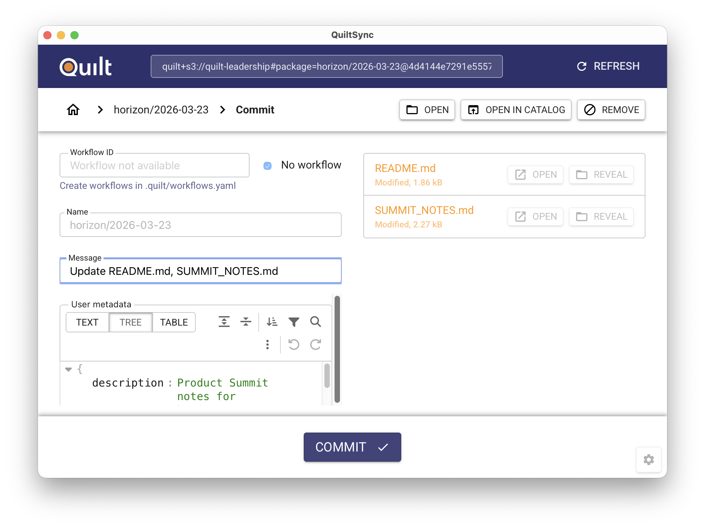

# QuiltSync

QuiltSync is a desktop application for syncing versioned Quilt data packages to
your local machine. It provides local access to Quilt packages stored in S3,
with support for Windows 10+, macOS 10.14+ (Intel & Apple Silicon), and Linux.

## Features

- Browse and sync packages via graphical interface
- Selective file sync to manage disk space
- Version control for data packages
- Browser-based authentication
- Auto-generated commit messages (v0.14+)

## Getting Started

### Installation

Download and install QuiltSync from
[quilt.bio/quiltsync](https://quilt.bio/quiltsync/).

### Opening Packages and Files

From the Quilt web catalog:

1. Navigate to a package or file
2. Click "Get Package" or "Get File"
3. Select "Open in QuiltSync"

### Authentication

On first use, QuiltSync prompts for authentication via your web browser:

1. QuiltSync opens your browser to the Quilt Catalog login page
2. Sign in to your catalog
3. Copy access token to QuiltSync

The token is tied to your catalog session. No AWS credentials required.

### Selective Installation

When the package is opened, it shows a list of all files (pre-selected for download).

### Committing Changes

After modifying synced files locally, you can commit changes back to Quilt as a
new package version:

1. Open the commit page in QuiltSync
2. Review the auto-generated commit message, which summarizes the changed files
3. Edit the message if needed
4. Click **Commit** to create a new revision
5. Click **Push** to upload that revision and set it as latest

### Settings and Troubleshooting

Access settings via the gear icon in the lower right:

- **Version**: Current version and release notes
- **Lineage and cache files**: Opens `.quilt/` directory with package metadata
- **Logs directory**: Application logs for debugging
- **Reset state**: "RELOAD PAGE" refreshes UI, "RE-LOGIN" clears authentication

If QuiltSync fails to start after an upgrade, use **RE-LOGIN** or clear the
`.quilt/` cache directory. Older cached manifests in Parquet format are
automatically re-fetched from remote storage.

### Integration with Benchling

QuiltSync integrates with the [Benchling Webhook](./benchling.md) to provide
seamless access to Quilt packages from Benchling notebooks.

When viewing a package in the Benchling App Canvas:

1. Click the "sync" button next to any package or file
2. QuiltSync automatically opens with the selected package
3. Select files to sync locally
4. Work offline with your data

This integration allows scientists to move from notebook entries to local
datasets without leaving their Benchling workflow. For more details, see
[Benchling App Canvas](./benchling.md#benchling-app-canvas).
