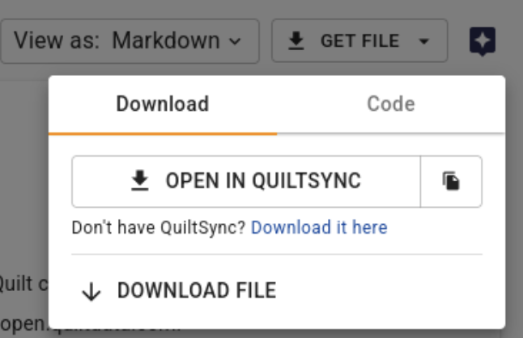
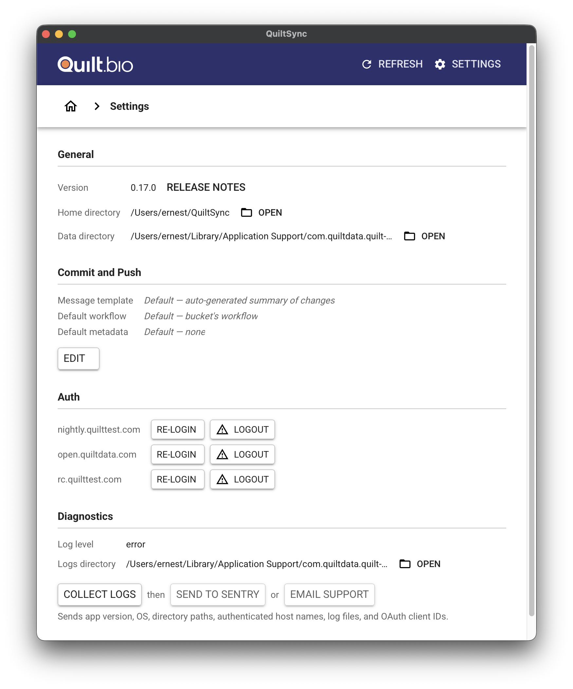

# QuiltSync

**Desktop client for seamless access to versioned, AI-ready datasets.**

Visit [quilt.bio/quiltsync](https://quilt.bio/quiltsync/) to download the
latest version.

QuiltSync is a desktop application from Quilt Data that enables scientists,
researchers, and engineers to access, manage, and version large datasets
locally. Install once and seamlessly sync Quilt data packages (versioned,
AI/ML-ready datasets) to your computer across Windows, macOS (Intel & Apple
Silicon), and Linux.

With QuiltSync, you can:

- Browse and install Quilt packages through an intuitive graphical interface
- Selectively sync specific files from packages to save disk space
- Access cloud-stored datasets as if they were local files
- Maintain version control and reproducibility for your data workflows

## Getting Started

### Installation

Download QuiltSync from [quilt.bio/quiltsync](https://quilt.bio/quiltsync/)
and install it on your system. The application will integrate with your Quilt
catalog and be ready to sync packages.

### Opening Packages and Files

When viewing packages in the Quilt web catalog, you can open them directly in
QuiltSync:

1. Navigate to a package or file in your Quilt catalog
2. Click the "Get Package" or "Get File" button
3. Select "Open in QuiltSync" from the dropdown menu
4. QuiltSync will open automatically (if installed) and display the package
   contents

The dropdown also provides a "Download it here" link if you need to install
QuiltSync first, as well as options to download files directly.

### Authentication

The first time you open a catalog URI in QuiltSync, you'll be prompted to
authenticate:

1. QuiltSync will prompt you to obtain an access token
2. Your web browser will open to your Quilt Catalog login page
3. Sign in to your catalog (if not already signed in)
4. The access token will be automatically provided to QuiltSync
5. QuiltSync will use this token tied to your catalog session for all future
   access

No AWS credentials configuration is required—authentication is handled
seamlessly through your browser and catalog session.

### Selective Installation

QuiltSync allows you to choose which files to sync locally:

- Use the checkboxes to select specific files or folders
- Click "SELECT ALL" to sync the entire package
- Review file sizes before installing to manage disk space
- Click "INSTALL" to begin syncing selected files to your local machine

This selective sync capability is particularly useful for large packages where
you only need specific files for your workflow.

### Settings and Troubleshooting

Access QuiltSync settings by clicking the gear icon in the application. The
settings panel provides useful information and troubleshooting tools:

- **Version**: View the current QuiltSync version and access release notes
- **Lineage and cache files**: Open the `.quilt/` directory to inspect local
  package metadata and cached data
- **Logs directory**: View application logs for debugging and troubleshooting
  issues
- **Reset state**: Use "RELOAD PAGE" to refresh the interface or "RE-LOGIN" to
  clear authentication and start fresh

These tools are particularly helpful when troubleshooting authentication
issues, investigating sync problems, or providing information for support
requests.

### Integration with Benchling

QuiltSync integrates with the [Benchling Webhook](./benchling.md) to provide
seamless access to notebook-linked packages:

- In Benchling's App Canvas, click the "sync" button next to any package
- The package or file will open directly in QuiltSync
- Changes and updates are reflected across both platforms

## Overview

QuiltSync brings the power of Quilt data packages to your desktop, providing
a local sync solution for cloud-stored data. While datasets may live in
remote storage (S3), QuiltSync gives you local access so you can work offline
or interact with datasets as if they're on your machine.

## Key Features

### Graphical User Interface

QuiltSync provides an intuitive desktop interface for working with Quilt
packages:

- **Package Browser**: Navigate S3-based packages with a familiar file browser
  interface
- **Selective Sync**: Choose individual files or entire directories to install
- **Quick Actions**: Refresh package contents, access settings, and open
  packages in the web catalog
- **File Preview**: View file sizes and directory structures before installing
- **Progress Tracking**: Monitor installation progress for large datasets

### Versioned Data Packages

QuiltSync doesn't just pull files—Quilt packages include version control for
data, tracking changes and enabling reproducible workflows. Each package has
a complete version history, allowing you to:

- Track data changes over time
- Roll back to previous versions
- Ensure reproducible analysis and ML workflows
- Collaborate with confidence that everyone uses the same data version

### Desktop/Local Access

Even though data lives in cloud storage, QuiltSync provides local sync
capabilities:

- Work offline with synced datasets
- Interact with S3 data as if it's on your local machine
- Reduce latency for data-intensive operations
- Control which packages and versions are synced locally
- Save bandwidth by selectively syncing only needed files

### AI-Ready Format

The platform targets researchers, machine learning engineers, and data science
teams who need clean, versioned datasets prepared for AI/ML pipelines:

- Datasets formatted for machine learning workflows
- Metadata and schema validation
- Integration with data science tools and notebooks
- Support for large-scale data operations

## System Requirements

QuiltSync runs on all major operating systems:

- **Operating Systems**: Windows 10+, macOS 10.14+, Linux (modern
  distributions)
- **Disk Space**: Varies based on package sizes you plan to sync (consider
  storage for large datasets)
- **Network**: Internet connection required for syncing with S3 and
  authenticating with your Quilt Catalog (bandwidth considerations for large
  datasets)
- **Authentication**: Browser-based login to your Quilt Catalog (no AWS
  credentials needed)
