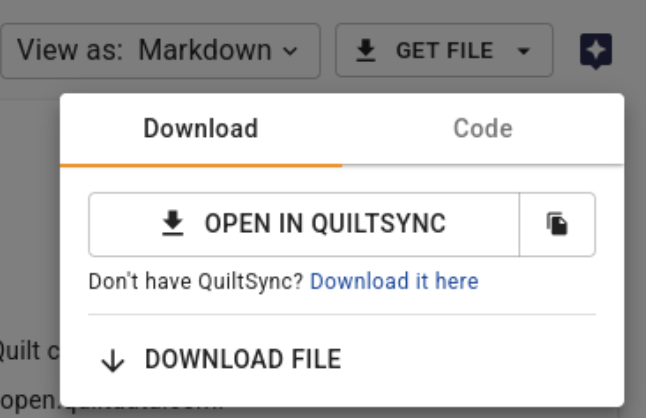
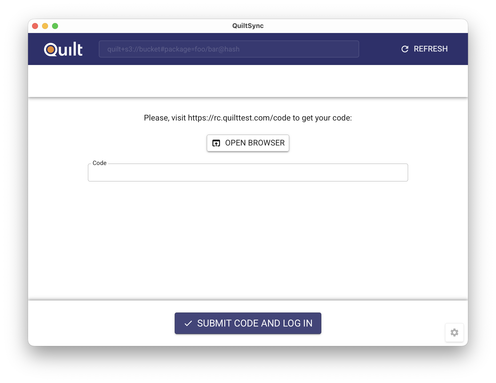
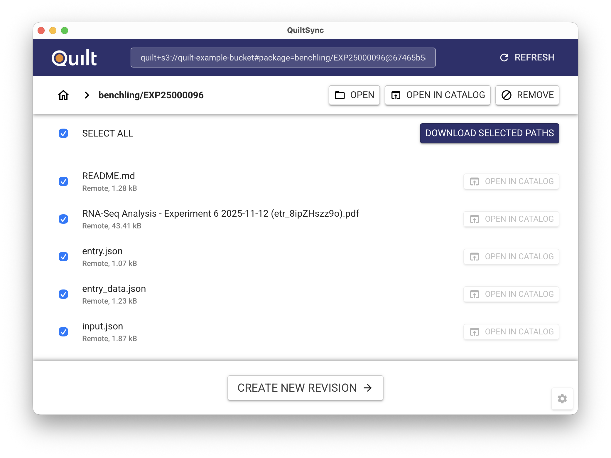
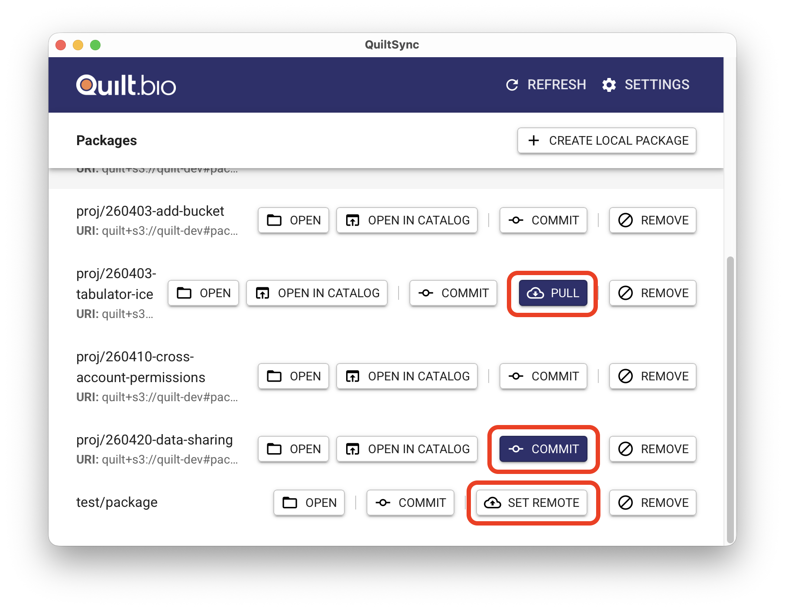
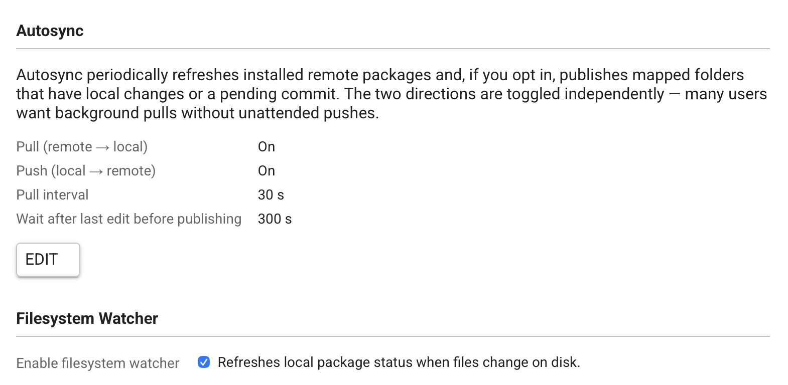
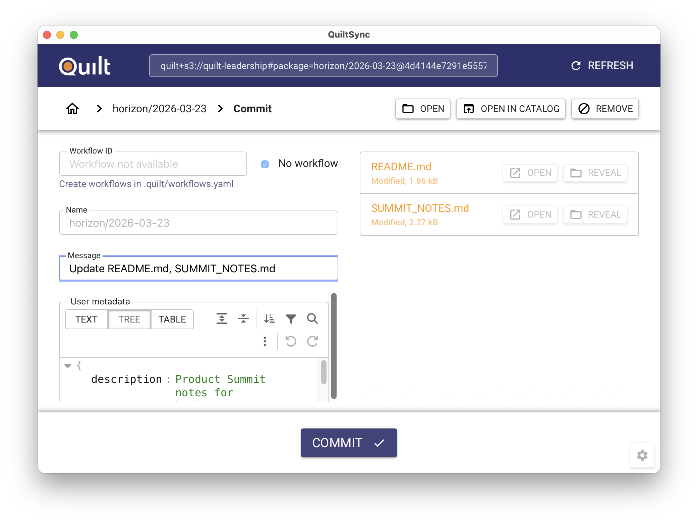
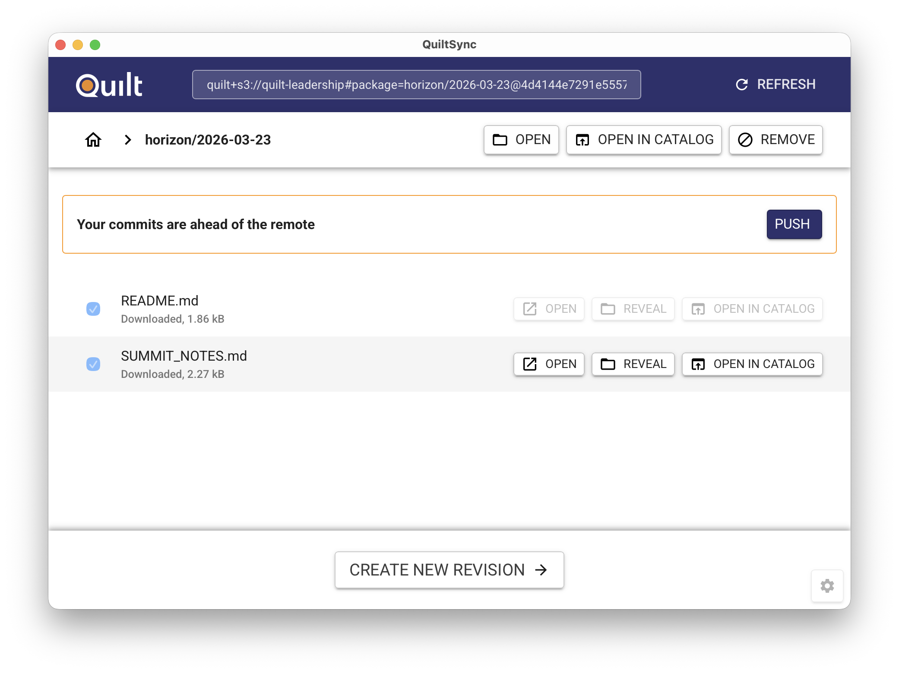
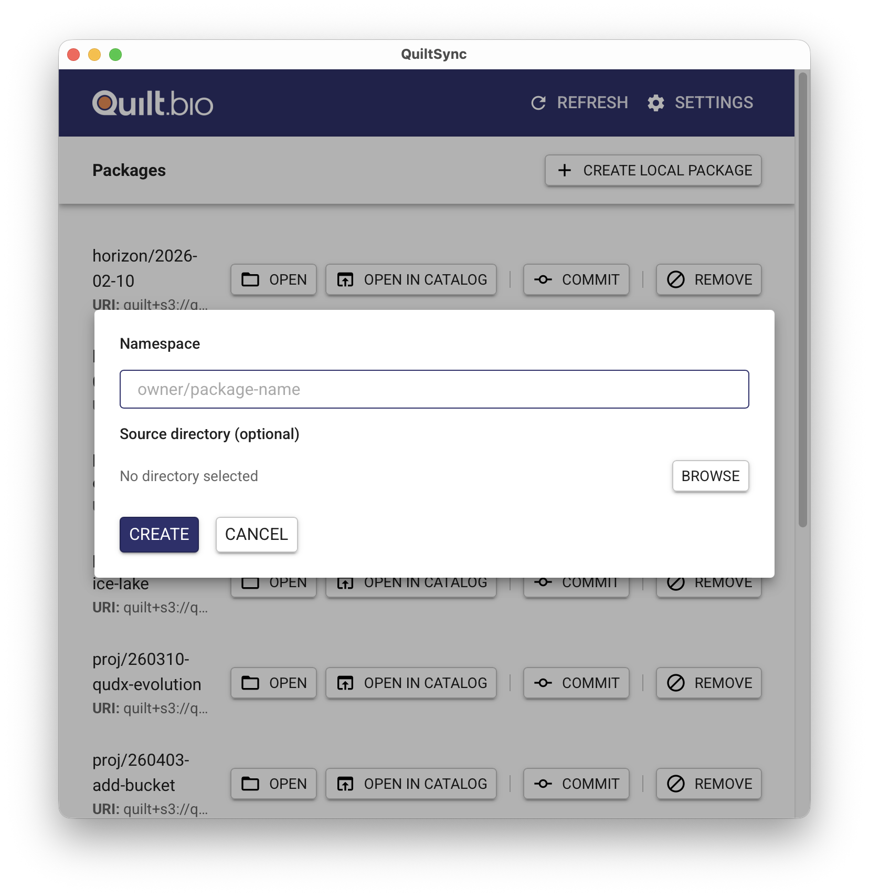
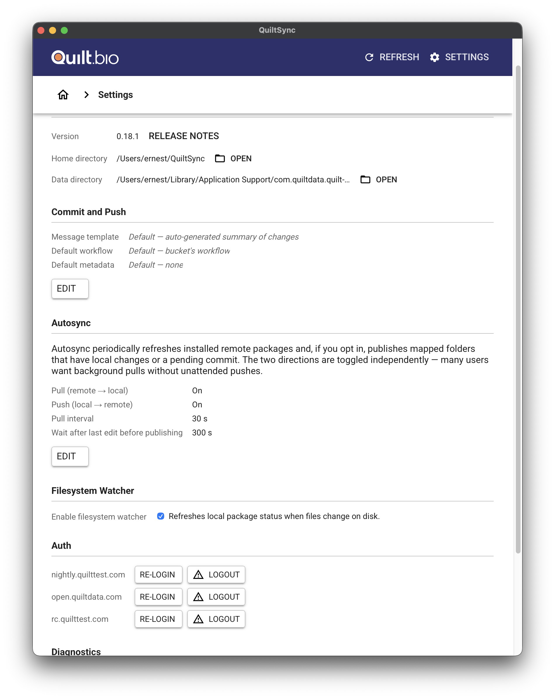
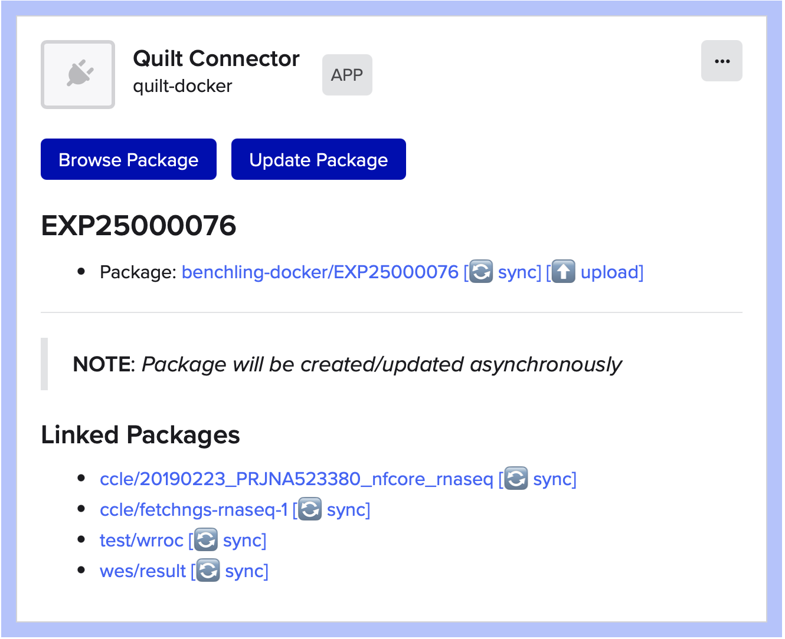

# QuiltSync

QuiltSync is a desktop application for syncing versioned Quilt data packages to
your local machine. It provides local access to Quilt packages stored in S3,
with support for Windows 10+, macOS 10.14+ (Intel & Apple Silicon), and Linux.

## Features

- Browse and sync packages via graphical interface
- Selective file sync to manage disk space
- Version control for data packages
- Browser-based OAuth 2.1 login (with legacy code-based fallback)
- Auto-generated commit messages
- Automatic detection of local and remote changes, with context-aware actions
  (e.g., **Commit and Push** when local edits exist, **Pull** when the remote
  is ahead, **Merge** when both sides diverged)
- One-click **Commit and Push** with per-user defaults (message template,
  workflow, metadata) configured in Settings
- Opt-in **Autosync** with independent Pull and Push toggles
- Tray icon with **Close to tray**, so Autosync keeps running with the main
  window closed
- Live filesystem watcher that refreshes local package status as files change
- Create local-only packages and set a remote later
- `.quiltignore` support with junk-file detection
- Unified Settings pane for general info, publish defaults, auth management,
  and diagnostics
- Companion `quilt` command-line interface published to
  [crates.io](https://crates.io)

## Getting Started

### Installation

Download and install QuiltSync from
[quilt.bio/quiltsync](https://quilt.bio/quiltsync/).

### Opening Packages and Files

From the Quilt web catalog:

1. Navigate to a package or file
2. Click "Get Package" or "Get File"
3. Select "Open in QuiltSync"



### Authentication

On first use, QuiltSync authenticates you through your web browser. It prefers
OAuth 2.1 Authorization Code flow with PKCE, and falls back to the legacy
code-based flow for catalogs that do not yet support OAuth.

**OAuth (default):**

1. QuiltSync opens your browser to the Quilt Catalog login page
2. Sign in to your catalog
3. The browser returns to QuiltSync automatically via a `quilt://` deep link

**Legacy (fallback):**

1. QuiltSync opens your browser to the Quilt Catalog login page
2. Sign in to your catalog
3. Copy the access token from the browser back into QuiltSync

Either way the session is tied to your catalog login — no AWS credentials
required.



### Selective Installation

When the package is opened, it shows a list of all files (pre-selected for download).



### Status-Aware Actions

QuiltSync continuously compares each package's local working copy against its
remote revision and highlights only the actions that apply:

- **Commit and Push** activates when the package has a remote and something to
  ship — uncommitted changes, a pending local commit, or both. It uses the
  defaults configured in Settings → Commit and Push.
- **Pull** activates when the remote has new revisions not yet synced locally
  (disabled with a tooltip hint if the package has uncommitted local changes)
- **Merge** activates when local and remote have diverged
- **Set Remote** appears on local-only packages that have no remote yet



### Background Autosync

> New in Quilt Platform version 1.70

QuiltSync includes an opt-in **Autosync** loop with independent **Pull** and
**Push** toggles:

- **Auto-pull** refreshes `latest` for installed remote packages when the
  working tree is clean.
- **Auto-push** commits and publishes quiet local changes using your
  configured **Commit and Push** defaults. It pauses automatically when a
  package has pending changes you are still editing or when local and remote
  have diverged, so it never overwrites work in progress.

A live per-mapping **filesystem watcher** refreshes local package status when
files change on disk, so status badges and entry lists update within about
half a second without a manual reload. Both are configured in Settings:



### Tray Icon and Close to Tray

> New in Quilt Platform version 1.70

A tray-resident shell keeps Autosync running even with the main window
closed. Enable **Close to tray** in Settings to hide the window instead of
quitting. The tray icon reflects current status — idle, syncing, paused, or
error — and offers **Open Quilt** and **Quit** actions.

### Resolving Divergence (Merge)

> Updated in Quilt Platform version 1.70

When local and remote diverge, the **Merge** page labels each action by the
direction data flows:

- **Promote my commit** pushes your local commit and then tags it as
  `latest` (the push now happens before tagging, so `latest` only ever points
  at a revision that has been uploaded).
- **Overwrite local with remote** resets your local state to the remote
  revision, discarding uncommitted local edits.

### Committing Changes

After modifying synced files locally, you can commit changes back to Quilt as a
new package version:

1. Open the commit page in QuiltSync
2. Review the auto-generated commit message, which summarizes the changed files
3. Edit the message if needed
4. Click **Commit** to create a new revision
5. Click **Push** to upload that revision and set it as latest





### Ignoring Junk Files

QuiltSync honors `.quiltignore` files to keep build artifacts, OS metadata, and
other noise out of your packages:

- Files matching a `.quiltignore` pattern are flagged with a "junk" badge in
  the entry list
- Per-entry popups let you **ignore** a file (adds a pattern to
  `.quiltignore`) or **un-ignore** one already covered by a pattern
- The package view also lets you toggle visibility of unmodified and ignored
  entries so only the files relevant to your next commit stay on screen

Use `.quiltignore` for transient outputs (e.g., `*.tmp`, `.DS_Store`,
`node_modules/`) that shouldn't end up in committed revisions.

### Creating Local Packages

You can start a package entirely on your machine and wire it to a remote later:

1. Click **+ Create Local Package** in the Packages header
2. Enter a package name `pkg_prefix/pkg_prefix` (labeled **Namespace** in the dialog)
3. Optionally **Browse** to select a source directory to seed the package
4. Click **Create**



The new package appears in the list with a **Set Remote** action. Use it when
you're ready to associate the package with an S3 bucket and push your first
revision.

### Settings and Troubleshooting

Access settings via **SETTINGS** in the top-right header.



- **General**: Version (with release notes), home directory, and data directory
- **Commit and Push**: Defaults used by the one-click **Commit and Push**
  action — message template (with `{date}`, `{time}`, `{datetime}`,
  `{namespace}`, and `{changes}` placeholders), default workflow (bucket
  default or an override), and default metadata. **Edit** opens the defaults
  popup with a live message preview.
- **Autosync**: Independent **Pull** and **Push** toggles, the pull interval,
  and the quiet period to wait after the last edit before publishing (see
  [Background Autosync](#background-autosync))
- **Filesystem Watcher**: Toggle for the live on-disk status watcher
- **Auth**: List of authenticated catalogs with per-host **Re-Login** and
  **Logout** controls
- **Diagnostics**: Log level, logs directory, **Collect Logs**, then **Send to
  Sentry** or **Email Support** to share diagnostics (app version, OS,
  directory paths, authenticated host names, log files, and OAuth client IDs)

If QuiltSync fails to start after an upgrade, use **Re-Login** for the affected
host or clear the data directory. Older cached manifests in Parquet format are
automatically re-fetched from remote storage.

### Companion `quilt` CLI

> New in Quilt Platform version 1.70

The QuiltSync-based `quilt` command-line interface is published to
[crates.io](https://crates.io) with prebuilt binaries for macOS and Linux.
Install it with [`cargo binstall`](https://github.com/cargo-bins/cargo-binstall):

```bash
cargo binstall quilt-cli
```

The CLI shares QuiltSync's data directory, so you can manage the same set of
local packages interchangeably from either the CLI or the GUI.

> This `quilt` CLI is distinct from the Python `quilt3`
> [CLI](../api-reference/cli.md), which ships with the `quilt3` package.

### Integration with Benchling

QuiltSync integrates with the [Benchling Webhook](./benchling.md) to provide
seamless access to Quilt packages from Benchling notebooks.



When viewing a package in the Benchling App Canvas:

1. Click the "sync" button next to any package or file
2. QuiltSync automatically opens with the selected package
3. Select files to sync locally
4. Work offline with your data

This integration allows scientists to move from notebook entries to local
datasets without leaving their Benchling workflow. For more details, see
[Benchling App Canvas](./benchling.md#benchling-app-canvas).
