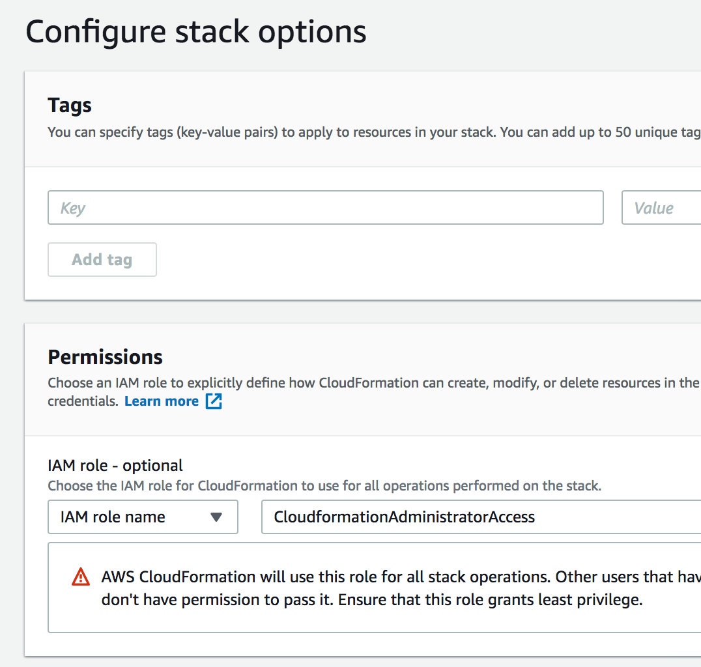
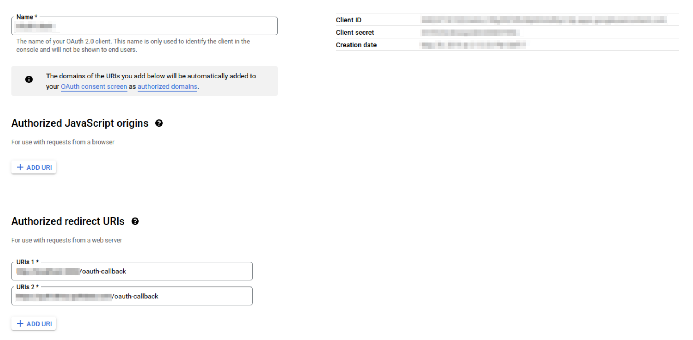

<!-- markdownlint-disable -->
# Run Quilt in Your AWS Account
Quilt is a data mesh that verifies the integrity of your data so that teams can
find, understand, and file discoveries based on data of any size or in any format.

A Quilt _instance_ is a private portal that runs in your virtual private cloud (VPC).

## Help and Advice

We encourage users to contact us before deploying Quilt.
We will make sure that you have the latest version of Quilt,
and walk you through the CloudFormation deployment.

We recommend that all users do one or more of the following:
* [Schedule a Quilt engineer](https://calendly.com/d/g6f-vnd-qf3/engineering-team)
to guide you through the installation

* [Join Quilt on Slack](https://slack.quiltdata.com/) to ask questions and
connect with other users

* [Email Quilt](mailto:contact@quiltdata.io)

## Architecture
Each instance consists of a CloudFormation stack that is privately hosted in your 
AWS account. The stack includes backend services for the catalog, S3 proxy,
SSO, user identities and IAM policies, an ElasticSearch cluster, and more.


### Network

> The above diagram is for _general guidance only_. See below for details.

You may provide your own VPC and subnets to a Quilt stack or have the Quilt stack
create its own subnets. In both cases Quilt uses subnets and security groups
to isolate network services. You may optionally provide your own VPC CIDR block
with a /16 prefix if the default block of 10.0.0.0/16 conflicts with shared or
peered VPC services.

Below are the subnet configurations and sizes for Quilt version 2.0 networks,
new as of June 2023. The configuration is similar to the
[AWS Quick Start VPC](https://aws-quickstart.github.io/quickstart-aws-vpc/).

- 2 public subnets for NAT gateways and an internet-facing application load balancer
(1/4 the VPC CIDR)
- 2 private subnets for Quilt services in ECS or Lambda, and an inward facing
application load balancer
(1/8 of the VPC CIDR)
- 2 private subnets for intra-VPC traffic to and from the Quilt RDS database and
OpenSearch domain
(1/2 of the VPC CIDR)
- (1/8 of the VPC CIDR is free)

> Your Quilt instance contains _exactly one_ application load balancer that is
> either inward or internet-facing.

> If you provide the private subnets they are expected to route outbound
> requests to AWS services via a NAT Gateway.

> For cost-sensitive deployments, Quilt ECS services can be configured to use
> a single AZ.

For further details on private IPs and Quilt see
[Private endpoints](advanced-features/private-endpoint-access.md).

### Sizing
The Quilt CloudFormation template will automatically configure appropriate instance sizes for RDS, ECS (Fargate), Lambda and Elasticsearch Service. Some users may choose to adjust the size and configuration of their Elasticsearch cluster. All other services should use the default settings.

### Elasticsearch Service Configuration
By default, Quilt configures an Elasticsearch cluster with 3 master nodes and 2 data nodes. Please contact the Quilt support team before adjusting the size and configuration of your cluster to avoid disruption.

### Cost
The infrastructure costs of running a Quilt stack vary with usage. Baseline infrastructure costs start at $620 and go up from there. See below for a breakdown of baseline costs for `us-east-1` at 744 hours per month.

| Service  | Cost |
| ------------- | ------------- |
| Elasticsearch Service | $516.83 |
| RDS  | $75.56 |
| ECS (Fargate) | $26.64 |
| Lambda | Variable |
| CloudTrail | Variable |
| Athena | Variable |
| **Total** | **$619.03 + Variable Costs** |

### Health and Monitoring
To check the status of your Quilt stack after bring-up or update, check the stack health in the CloudFormation console.

### Elasticsearch Cluster
If you notice slow or incomplete search results, check the status of the Quilt Elasticsearch cluster. To find the Quilt search cluster from CloudFormation, click on the Quilt stack, then "Resources." Click on the "Search" resource.

If your cluster status is not "Green" (healthy), please contact Quilt support. Causes of unhealthy search clusters include:
* Running out of storage space
* High index rates (e.g., caused by adding or updating very large numbers of files in S3)

### Service Limits
This deployment does not require an increase in limits for your AWS Account.

### External Dependencies
In addition to containers running in Fargate, Quilt includes a set of AWS Lambda functions. These lambda functions are not scanned by AWS Marketplace. The [code for the lambda functions](https://github.com/quiltdata/quilt/tree/master/lambdas) is open-source and has been verified through an independent security audit.

## Requirements and Prerequisites

### Knowledge Requirements
Running Quilt requires working knowledge of [AWS CloudFormation](https://aws.amazon.com/cloudformation/), [AWS S3](https://aws.amazon.com/s3/) and [Elasticsearch Service](https://aws.amazon.com/elasticsearch-service/).

### Before you install Quilt

You will need the following:

1. **An AWS account**.
    1. **The service-linked role for Elasticsearch**
    > This role is not created automatically when you use Cloudformation or other
    > APIs.

    You can create the role as follows:
        ```
        aws iam create-service-linked-role --aws-service-name es.amazonaws.com
        ```
1. **IAM Permissions** to create the CloudFormation stack (or Add products in
Service Catalog).
    1. We recommend that you use a
    [CloudFormation service role](https://docs.aws.amazon.com/AWSCloudFormation/latest/UserGuide/using-iam-servicerole.html)
    for stack creation and updates.
    1. See this [example service role](./cfn-service-role.yml) for minimal permissions
    to install a Quilt stack.

    > Ensure that your service role is up-to-date with the example before every stack
    update so as to prevent installation failures.

1. The **ability to create DNS entries**, such as CNAME records,
for your company's domain.
1. **An SSL certificate in the same region as your Quilt instance** to secure the domain where your users will access your Quilt instance.
    1. For example, to make your Quilt catalog available at `https://quilt.mycompany.com`,
    you require a certificate for either `*.mycompany.com` *or* for the following 3 domains:
    `quilt.mycompany.com`, `quilt-registry.mycompany.com` and `quilt-s3-proxy.mycompany.com`
    in the [AWS Certificate Manager](https://aws.amazon.com/certificate-manager/). 
    1. You may either [create a new certificate](https://docs.aws.amazon.com/acm/latest/userguide/gs-acm-request-public.html), or
    [import an existing certificate](https://docs.aws.amazon.com/acm/latest/userguide/import-certificate.html).
    1. The ARN for this certificate or set of certificates is required for use as the `CertificateArnELB` CloudFormation parameter.
1. For maximum security, Quilt requires **a region that supports
[AWS
Fargate](https://aws.amazon.com/about-aws/global-infrastructure/regional-product-services/)**.
As of this writing, all U.S. regions support Fargate.
1. **An S3 Bucket** for your team data. This may be a new or existing
bucket. The bucket should not have any notifications attached to
it (`S3 Console > Bucket > Properties > Events`). Quilt will need
to install its own notifications. Installing Quilt will modify the
following Bucket characteristics:
    1. Permissions > CORS configuration (will be modified for secure web access).
    1. Properties > Object-level logging (will be enabled).
    1. Properties > Events (will add one notification).

    > Buckets in Quilt may choose to enable versioning or disable versioning.
    **It is strongly recommended that you keep versioning either on or off during the entire lifetime
    of the bucket**. Toggling versioning on and off incurs edge cases that may cause
    bugs with any state that Quilt stores in ElasticSearch due to inconsistent semantics
    of `ObjectRemoved:DeleteMarkerCreated`.

1. Available **CloudTrail Trails** in the region where you wish to host your stack
([learn more](https://docs.aws.amazon.com/awscloudtrail/latest/userguide/WhatIsCloudTrail-Limits.html)).
1. A license key or an active subscription to Quilt Business on AWS Marketplace. 
    1. Click `Continue to Subscribe` on the [Quilt Business Listing](https://aws.amazon.com/marketplace/pp/B07QF1VXFQ) to
    subscribe then return to this page for installation instructions.
    1. **The CloudFormation template and instructions on AWS Marketplace are infrequently updated and may be missing critical bugfixes.**

### AWS Marketplace

You can install Quilt via AWS Marketplace. As indicated above, we
recommend that you [contact us first](#installation-instructions).

### AWS Service Catalog

1. Email [contact@quiltdata.io](mailto:contact@quiltdata.io)
with your AWS account ID to request access to Quilt through the 
AWS Service Catalog and to obtain a license key.
1. Click the service catalog link that you received from Quilt. Arrive at the Service Catalog.
Click IMPORT, lower right.

    

1. Navigate to Admin > Portfolios list > Imported Portfolios. Click Quilt Enterprise.

    

1. On the Portfolio details page, click ADD USER, GROUP OR ROLE. Add any users,
**including yourself**, whom you would like to be able to install Quilt.

    

1. Click Products list, upper left. Click the menu to the left of Quilt CloudFormation
Template. Click Launch product. (In the future, use the same menu to upgrade
Quilt when a new version is released.)

    

1. Continue to the [CloudFormation](#CloudFormation) section.
Note: the following screenshots may differ slightly fromm what
you see in Service Catalog.

### CloudFormation

1. Specify stack details in the form of a stack _name_ and CloudFormation
_parameters_. Refer to the descriptions displayed above each
text box for further details. Service Catalog users require a license key. See
[Before you install Quilt](#before-you-install-quilt) for how to obtain a license key.

    

1. If you wish to use a service role, specify it as follows:

    

1. Service Catalog users, skip this step. Under Stack creation
options, enable termination protection. This protects the stack
from accidental deletion. Click Next.

    

1. Service Catalog users, skip this step. Check the box asking you
to acknowledge that CloudFormation may create IAM roles, then click
Create.

    

1. CloudFormation takes about 30 minutes to create the resources
for your stack. You may monitor progress under Events.
Once the stack is complete, you will see `CREATE_COMPLETE` as the Status for
your CloudFormation stack.

    

1. To finish the installation, you will want to view the stack Outputs.

    

In a separate browser window, open the DNS settings for your domain.
Create the following `CNAME` records. **Replace italics** with the
corresponding stack Outputs.

| CNAME | Value |
| ------ | ------- |
| `<QuiltWebHost>` Key  | `LoadBalancerDNSName` | 
| `<RegistryHostName>` Key  | `LoadBalancerDNSName` |
| `<S3ProxyHost>` Key  | `LoadBalancerDNSName` | 

Quilt is now up and running. You can click on the _QuiltWebHost_ value
in Outputs and log in with your administrator password to invite users.

## Routine Maintenance and Upgrades

Major releases will be posted to AWS Marketplace. Minor releases will be announced via email and Slack. Join the [Quilt mailing list](http://eepurl.com/bOyxRz) or [Slack Channel](https://slack.quiltdata.com/) for updates.

To update your Quilt stack, apply the latest CloudFormation template in the CloudFormation console as follows.

1. Navigate to AWS Console > CloudFormation > Stacks
1. Select your Quilt stack
1. Click Update (upper right)
1. Choose Replace current template
1. Enter the Amazon S3 URL for your template
1. Click Next (several times) and proceed to apply the update

Your previous settings should carry over.

## Security

All customer data and metadata in Quilt is stored in S3. It may also be cached in Elasticsearch Service (show in red in the diagram below). No other services in the Quilt stack store customer data.


We recommend using [S3 encryption](https://docs.aws.amazon.com/AmazonS3/latest/userguide/UsingEncryption.html) and [Elasticsearch Service encryption at rest](https://docs.aws.amazon.com/elasticsearch-service/latest/developerguide/encryption-at-rest.html) to provide maximum protection.

User email addresses are stored by the Identity Service in RDS Postgres (part of the Quilt stack). User email addresses are also sent through an encrypted channel to the customer support messaging system ([Intercom](https://www.intercom.com/)).

## Advanced configuration

The default Quilt settings are adequate for most use cases. The following section
covers advanced customization options.

### Setting the default role

**The Quilt admin must log in and set the default role** in order for new 
users to be able to sign up.


## Single sign-on (SSO)

### Google

You can enable users on your Google domain to sign in to Quilt.
Refer to [Google's instructions on OAuth2 user agents](https://developers.google.com/identity/protocols/OAuth2UserAgent)
and create authorization credentials to identify your Quilt stack
to Google's OAuth 2.0 server.



Copy the `Client ID` and `Client secret` to a safe place.
Add `<QuiltWebHost>/oauth-callback` to *authorized redirect URIs*.

### Active Directory

1. Go to Azure Portal > Active Directory > App Registrations.
1. Click "New Registration".
1. Name the app, select the Supported account types.
1. Click "Add a platform", "Web", and enter the `Redirect URIs` value
`<QuiltWebHost>/oauth-callback`. Click "Save" at the bottom.
1. Once the application has been created you will need both its `Application
(client) ID` and `Directory (tenant) ID`.

    

1. Go to "Client credentials" and create a new client secret. Note you will use
the `Value` (and not the `Secret ID`).

    

1. Your `AzureBaseUrl` will be of the form
`https://ENDPOINT/TENANT_ID`. In most cases `ENDPOINT` is simply
`login.microsoftonline.com`. Reference
[Microsoft identity platform and OpenID Connect protocol](https://docs.microsoft.com/en-us/azure/active-directory/develop/v2-protocols-oidc)
and
[National clouds](https://docs.microsoft.com/en-us/azure/active-directory/develop/authentication-national-cloud)
for further details. 
    > **If `AzureBaseUrl` doesn't end in `/v2.0`
    then append `/v2.0` to it.**
1. Click "Save".
1. Copy the `Application (client) ID`, `Client secret Value`, and
`AzureBaseUrl` to a safe place.
1. Proceed to [Enabling SSO](#enabling-sso-in-cloudformation).


### Okta

1. Go to Okta > Admin > Applications > Applications

    

1. Click `Create App Integration`. A new modal window opens.
1. Assign `Sign-in method` radio button to `OIDC - OpenID Connect`.
1. Assign `Application type` radio button to `Web Application`.

    

1. Click the `Next` button.
1. Rename the default `App integration name` to `Quilt` or something distinctive for your organization to identify it.
1. Add the [Quilt logo](https://user-images.githubusercontent.com/1322715/198700580-da72bd8d-b460-4125-ba31-a246965e3de8.png) for user recognition.
1. Configure the new web app integration as follows:
    1. For `Grant type` check the following: `Authorization Code`, `Refresh Token`, and `Implicit (hybrid)`.
    1. To the `Sign-in redirect URIs` add `<QuiltWebHost>/oauth-callback` URL. 
    1. Leave the `Allow wildcard * in the login URI redirect` checkbox **unchecked**.
    1. Optionally add to the `Sign-out redirect URIs` (if desired by your organization).
    1. For the `Assignments > Controlled Access` selection, choose the option desired by your organization.
1. Once you click the `Save` button you will have a new application integration to review.
    1. If it's undefined, update the `Initiate login URI` to your `<QuiltWebHost>` URL.
    1. Copy the `Client ID`, `Secret`, and `Base URL` to a safe place
1. Go to **Okta > Security > API > Authorization servers**
    1. You should see a `default` entry with the `Audience` value set
    to `api://default`, and an `Issuer URI` that looks like the
    following:

        ```
        <MY_COMPANY>.okta.com/oauth2/default
        ```

    1. See [Okta authorization servers](https://developer.okta.com/docs/concepts/auth-servers/#which-authorization-server-should-you-use) for more.
1. Proceed to [Enabling SSO](#enabling-sso-in-cloudformation)

### OneLogin

1. Go to Administration > Applications > Custom Connectors
1. Click `New Connector`
    1. Name the connector *Quilt Connector* or something similar
    1. Set `Sign on method` to `OpenID Connect`
    1. Set `Login URL` to `<QuiltWebHost>/oauth-callback`
    1. Click "Save"
1. Go back to Applications > Custom Connectors
1. Click `Add App to Connector`
1. Save the app (be sure to save it for the Organization)
1. Go to Applications > Applications > *Your new app* > SSO
    1. Click SSO. Copy the `Client ID`, `ClientSecret` and `Issuer URL` to a safe place.
    1. "Application Type" should be set to `Web`.
    1. "Token Endpoint" should be set to `POST`.

    

1. Add *Your new app* to the users who need to access Quilt:

    

1. Proceed to [Enabling SSO](#enabling-sso-in-cloudformation).

### Enabling SSO in CloudFormation

Now you can connect Quilt to your SSO provider. In the Quilt template
(AWS Console > CloudFormation > *Quilt stack* > Update > Use current
template > Next > Specify stack details), under `Auth Settings` set
the `PasswordAuth` to `Enabled`.

Next, select your `SingleSignOnProvider` from the dropdown list (one of Google, Okta, OneLogin, Azure).


Use the following settings (depending on your SSO provider):

| CFT Parameter | Google SSO | Okta SSO | OneLogin SSO | Azure SSO |
| ------------- | ---------- | -------- | ------------ | --------- |
| `SingleSignOnClientId` | `Client ID` | `Client ID` | `Client ID` | `Application (client) ID` |
| `SingleSignOnClientSecret` | `Client secret` | `Secret` | `ClientSecret` | `Client secret Value` |
| `SingleSignOnBaseUrl` | N/A | `Base URL` | `Issuer URL` | `AzureBaseUrl` |

> Be sure to set the [default role](#setting-the-default-role) as indicated above.

### Preparing an AWS Role for use with Quilt

These instructions document how to set up an existing role for use with Quilt. If the role you want to use doesn't exist yet, create it now. For guidance creating IAM roles, see: [IAM best practices](https://docs.aws.amazon.com/IAM/latest/UserGuide/best-practices.html), and the [Principle of Least Privilege](https://docs.aws.amazon.com/IAM/latest/UserGuide/best-practices.html#grant-least-privilege) 

Go to your Quilt stack in CloudFormation. Go to `Outputs`, then find `RegistryRoleARN` and copy its value. It should look something like this: `arn:aws:iam::000000000000:role/stackname-ecsTaskExecutionRole`.

Go to the IAM console and navigate to `Roles`. Select the role you want to use. Go to the `Trust Relationships` tab for the role, and select `Edit Trust Relationship`. The statement might look something like this:

```json
{
  "Version": "2012-10-17",
  "Statement": [
    "... one or more statements"
  ]
}
```

Add an object to the beginning of the Statement array with the following contents:

```json
{
  "Effect": "Allow",
  "Principal": {
    "AWS": "$YOUR_REGISTRY_ROLE_ARN"
  },
  "Action": "sts:AssumeRole"
},
```

Note the comma after the object. Your trust relationship should now look something like this:

```json
{
  "Version": "2012-10-17",
  "Statement": [
    {
      "Effect": "Allow",
      "Principal": {
        "AWS": "$YOUR_REGISTRY_ROLE_ARN"
      },
      "Action": "sts:AssumeRole"
    },
    "... whatever was here before"
  ]
}
```

You can now configure a Quilt Role with this role (using the Catalog's admin panel, or `quilt3.admin.create_role`).

### S3 buckets with Service-Side Encryption using Key Management Service (SSE-KMS)

In order for Quilt to access and index buckets encrypted with SSE-KMS, you must do three things:

1. Add KMS Key Usage to Quilt Permission Boundary
2. Add Quilt Principals to KMS Key Policy
3. Add KMS Key Access to a Source=Quilt Role

NOTE: This will not work with the default Source=Custom Roles.

#### 1. Add KMS Key Usage to Quilt Permission Boundary

By default, AWS does not allow anything in your account to access KMS. 
If you haven't done so already, 
create an IAM policy that explicitly enables KMS access.

```json
{
  "Version": "2012-10-17",
  "Statement": {
    "Effect": "Allow",
    "Action": [
      "kms:Encrypt",
      "kms:Decrypt"
    ],
    "Resource": "arn:aws:kms:us-west-2:111122223333:key/*"
  }
}
```

Go to CloudFormation > Your Quilt Stack -> Update -> Parameters 
and add the ARN of that IAM policy to  `ManagedUserRoleExtraPolicies` 
at the bottom of the page:


If other policies are already in that field, 
you will need to add a comma before appending the ARN.

#### 2. Add Quilt Principals to KMS Key Policy

In order for Quilt to index buckets with SSE-KMS, 
you must add certain principals to the corresponding key policy. 
Go to CloudFormation > Your Quilt Stack > Resources
and look for IAM roles with the following logical IDs:

* `AmazonECSTaskExecutionRole`
* `PkgEventsRole`
* `PkgSelectLambdaRole`
* `SearchHandlerRole`
* `T4BucketReadRole`
* `T4BucketWriteRole`

Note the ARN for each of the above logical IDs and add an Allow statement
similar to the following to the KMS key policy:

```json
{
    "Effect": "Allow",
    "Principal": {
        "AWS": [
            "<RoleARN-1>",
            ...
            "<RoleARN-N>"
        ]
    },
    "Action": [
        "kms:Decrypt",
        "kms:GenerateDataKey"
    ],
    "Resource": "*"
}
```

#### 3. Add KMS Key Access to Quilt Role

Finally, you need create a restricted policy 
that gives a Quilt role access to the keys for specific buckets, e.g:

```json
{
  "Version": "2012-10-17",
  "Statement": {
    "Effect": "Allow",
    "Action": [
      "kms:Encrypt",
      "kms:Decrypt"
    ],
    "Resource": [
      "arn:aws:kms:us-west-2:111122223333:key/1234abcd-12ab-34cd-56ef-1234567890ab",
      "arn:aws:kms:us-west-2:111122223333:key/0987dcba-09fe-87dc-65ba-ab0987654321"
    ]
  }
}
```

You can now create a Quilt Policy from this policy using the Catalog's admin panel.
Afterwards, you can attach that Policy to a user-defined Quilt Role
(which has Source=Quilt in the Roles panel, 
as opposed to system-defined Source=Custom Roles).

## Backup and Recovery

All data and metadata in Quilt is stored in S3. S3 data is automatically backed up (replicated across multiple available zones). To protect against accidental deletion or overwriting of data, we strongly recommend enabling object versioning for all S3 buckets connected to Quilt.

No data will be lost if a Quilt stack goes down. The Quilt search indexes will be automatically rebuilt when buckets are added to a new stack.

### Region Failure
To protect against data loss in the event of a region failure, enable
[S3 Bucket Replication](https://aws.amazon.com/s3/features/replication/) on all S3 buckets.

The time to restore varies with storage needs, but a <2-hour recovery time objective (RTO) and <15 minute recovery point objective (RPO) are generally possible.

To restore Quilt in your backup region:
1. Create a new Quilt stack from the same CloudFormation template in the backup region.
1. Connect the replica buckets (in the backup region) to your Quilt stack. In the Quilt catalog, select "Users and Buckets"->"Buckets" and enter the bucket information.

## Emergency Maintenance
See [Troubleshooting](Troubleshooting.md)

## Support
Support is available to all Quilt customers by:
* online chat (in the Quilt catalog)
* email to [support@quiltdata.io](mailto://support@quiltdata.io)
* [Slack](https://slack.quiltdata.com/)

Quilt guarantees response to support issues according to the following SLAs for Quilt Business and Quilt Enterprise customers.

### Quilt Business
|  | Initial Response | Temporary Resolution |
| ---- | ---- | ----- |
| Priority 1 | 1 business day | 3 business days |
| Priority 2 | 2 business days | 5 business days |
| Priority 3 | 3 business days | N/A |

### Quilt Enterprise
|  | Initial Response | Temporary Resolution |
| ---- | ---- | ----- |
| Priority 1 | 4 business hours | 1 business day |
| Priority 2 | 1 business day | 2 business days |
| Priority 3 | 1 business days | N/A |

### Definitions
*	*Business Day* means Monday through Friday (PST), excluding holidays observed by Quilt Data.
*	*Business Hours* means 8:00 a.m. to 7:00 p.m. (PST) on Business Days.
*	*Priority 1* means a critical problem with the Software in which the Software
inoperable;
*	*Priority 2* means a problem with the Software in which the Software is
severely limited or degraded, major functions are not performing properly, and
the situation is causing a significant impact to Customer’s operations or
productivity;
*	*Priority 3* means a minor or cosmetic problem with the Software in which any of the following occur: the problem is an irritant, affects nonessential
functions, or has minimal impact to business operations; the problem is
localized or has isolated impact; the problem is an operational nuisance; the
problem results in documentation errors; or the problem is any other problem
that is not a Priority 1 or a Priority 2, but is otherwise a failure of the
Software to conform to the Documentation or Specifications;
* *Temporary Resolution* means a temporary fix or patch that has been
implemented and incorporated into the Software by Quilt Data to restore
Software functionality.
