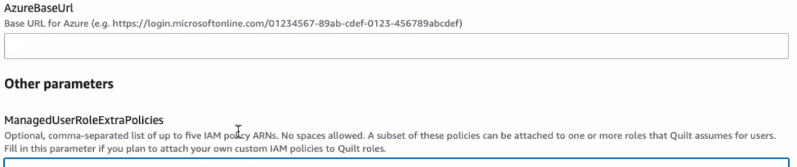

<!-- markdownlint-disable -->
# Enterprise Administration

This document covers advanced configuration and administration for Quilt Enterprise installations.

> For installation instructions, see [Installation](Installation.md).
> For architecture details, see [Architecture](Architecture.md).

## Health and Monitoring

To check the status of your Quilt stack after bring-up or update, check the stack health in the CloudFormation console.

### Elasticsearch Cluster
If you notice slow or incomplete search results, check the status of the Quilt Elasticsearch cluster. To find the Quilt search cluster from CloudFormation, click on the Quilt stack, then "Resources." Click on the "Search" resource.

If your cluster status is not "Green" (healthy), please contact Quilt support. Causes of unhealthy search clusters include:
* Running out of storage space
* High index rates (e.g., caused by adding or updating very large numbers of files in S3)

### Service Limits
This deployment does not require an increase in limits for your AWS Account.

### External Dependencies
In addition to containers running in Fargate, Quilt includes a set of AWS Lambda functions. These lambda functions are not scanned by AWS Marketplace. The [code for the lambda functions](https://github.com/quiltdata/quilt/tree/master/lambdas) is open-source and has been verified through an independent security audit.

## Advanced configuration

The default Quilt settings are adequate for most use cases. The following section
covers advanced customization options.

### Setting the default role

**The Quilt admin must log in and set the default role** in order for new 
users to be able to sign up.


## Single sign-on (SSO)

### Google

You can enable users on your Google domain to sign in to Quilt.
Refer to [Google's instructions on OAuth2 user agents](https://developers.google.com/identity/protocols/OAuth2UserAgent)
and create authorization credentials to identify your Quilt stack
to Google's OAuth 2.0 server.


Copy the `Client ID` and `Client secret` to a safe place.
Add `<QuiltWebHost>/oauth-callback` to *authorized redirect URIs*.

### Active Directory

1. Go to Azure Portal > Active Directory > App Registrations.
1. Click "New Registration".
1. Name the app, select the Supported account types.
1. Click "Add a platform", "Web", and enter the `Redirect URIs` value
`<QuiltWebHost>/oauth-callback`. Click "Save" at the bottom.
1. Once the application has been created you will need both its `Application
(client) ID` and `Directory (tenant) ID`.

    

1. Go to "Client credentials" and create a new client secret. Note you will use
the `Value` (and not the `Secret ID`).

    

1. Your `AzureBaseUrl` will be of the form
`https://ENDPOINT/TENANT_ID`. In most cases `ENDPOINT` is simply
`login.microsoftonline.com`. Reference
[Microsoft identity platform and OpenID Connect protocol](https://docs.microsoft.com/en-us/azure/active-directory/develop/v2-protocols-oidc)
and
[National clouds](https://docs.microsoft.com/en-us/azure/active-directory/develop/authentication-national-cloud)
for further details. 
    > **If `AzureBaseUrl` doesn't end in `/v2.0`
    then append `/v2.0` to it.**
1. Click "Save".
1. Copy the `Application (client) ID`, `Client secret Value`, and
`AzureBaseUrl` to a safe place.
1. Proceed to [Enabling SSO](#enabling-sso-in-cloudformation).

### Okta

1. Go to Okta > Admin > Applications > Applications

    

1. Click `Create App Integration`. A new modal window opens.
1. Assign `Sign-in method` radio button to `OIDC - OpenID Connect`.
1. Assign `Application type` radio button to `Web Application`.

    

1. Click the `Next` button.
1. Rename the default `App integration name` to `Quilt` or something distinctive for your organization to identify it.
1. Add the [Quilt logo](https://user-images.githubusercontent.com/1322715/198700580-da72bd8d-b460-4125-ba31-a246965e3de8.png) for user recognition.
1. Configure the new web app integration as follows:
    1. For `Grant type` check the following: `Authorization Code`, `Refresh Token`, and `Implicit (hybrid)`.
    1. To the `Sign-in redirect URIs` add `<QuiltWebHost>/oauth-callback` URL. 
    1. Leave the `Allow wildcard * in the login URI redirect` checkbox **unchecked**.
    1. Optionally add to the `Sign-out redirect URIs` (if desired by your organization).
    1. For the `Assignments > Controlled Access` selection, choose the option desired by your organization.
1. Once you click the `Save` button you will have a new application integration to review.
    1. If it's undefined, update the `Initiate login URI` to your `<QuiltWebHost>` URL.
    1. Copy the `Client ID`, `Secret`, and `Base URL` to a safe place
1. Go to **Okta > Security > API > Authorization servers**
    1. You should see a `default` entry with the `Audience` value set
    to `api://default`, and an `Issuer URI` that looks like the
    following:

        ```
        <MY_COMPANY>.okta.com/oauth2/default
        ```

    1. See [Okta authorization servers](https://developer.okta.com/docs/concepts/auth-servers/#which-authorization-server-should-you-use) for more.
1. Proceed to [Enabling SSO](#enabling-sso-in-cloudformation)

### OneLogin

1. Go to Administration > Applications > Custom Connectors
1. Click `New Connector`
    1. Name the connector *Quilt Connector* or something similar
    1. Set `Sign on method` to `OpenID Connect`
    1. Set `Login URL` to `<QuiltWebHost>/oauth-callback`
    1. Click "Save"
1. Go back to Applications > Custom Connectors
1. Click `Add App to Connector`
1. Save the app (be sure to save it for the Organization)
1. Go to Applications > Applications > *Your new app* > SSO
    1. Click SSO. Copy the `Client ID`, `ClientSecret` and `Issuer URL` to a safe place.
    1. "Application Type" should be set to `Web`.
    1. "Token Endpoint" should be set to `POST`.

    

1. Add *Your new app* to the users who need to access Quilt:

    

1. Proceed to [Enabling SSO](#enabling-sso-in-cloudformation).

### Enabling SSO in CloudFormation

Now you can connect Quilt to your SSO provider. In the Quilt template
(AWS Console > CloudFormation > *Quilt stack* > Update > Use current
template > Next > Specify stack details), under `Auth Settings` set
the `PasswordAuth` to `Enabled`.

Next, select your `SingleSignOnProvider` from the dropdown list (one of Google, Okta, OneLogin, Azure).


Use the following settings (depending on your SSO provider):

| CFT Parameter | Google SSO | Okta SSO | OneLogin SSO | Azure SSO |
| ------------- | ---------- | -------- | ------------ | --------- |
| `SingleSignOnClientId` | `Client ID` | `Client ID` | `Client ID` | `Application (client) ID` |
| `SingleSignOnClientSecret` | `Client secret` | `Secret` | `ClientSecret` | `Client secret Value` |
| `SingleSignOnBaseUrl` | N/A | `Base URL` | `Issuer URL` | `AzureBaseUrl` |

> Be sure to set the [default role](#setting-the-default-role) as indicated above.

### Preparing an AWS Role for use with Quilt

These instructions document how to set up an existing role for use with Quilt. If the role you want to use doesn't exist yet, create it now. For guidance creating IAM roles, see: [IAM best practices](https://docs.aws.amazon.com/IAM/latest/UserGuide/best-practices.html), and the [Principle of Least Privilege](https://docs.aws.amazon.com/IAM/latest/UserGuide/best-practices.html#grant-least-privilege) 

Go to your Quilt stack in CloudFormation. Go to `Outputs`, then find `RegistryRoleARN` and copy its value. It should look something like this: `arn:aws:iam::000000000000:role/stackname-ecsTaskExecutionRole`.

Go to the IAM console and navigate to `Roles`. Select the role you want to use. Go to the `Trust Relationships` tab for the role, and select `Edit Trust Relationship`. The statement might look something like this:

```json
{
  "Version": "2012-10-17",
  "Statement": [
    "... one or more statements"
  ]
}
```

Add an object to the beginning of the Statement array with the following contents:

```json
{
  "Effect": "Allow",
  "Principal": {
    "AWS": "$YOUR_REGISTRY_ROLE_ARN"
  },
  "Action": "sts:AssumeRole"
},
```

Note the comma after the object. Your trust relationship should now look something like this:

```json
{
  "Version": "2012-10-17",
  "Statement": [
    {
      "Effect": "Allow",
      "Principal": {
        "AWS": "$YOUR_REGISTRY_ROLE_ARN"
      },
      "Action": "sts:AssumeRole"
    },
    "... whatever was here before"
  ]
}
```

You can now configure a Quilt Role with this role (using the Catalog's Admin panel, or `quilt3.admin.create_role`).

### ManagedUserRoleExtraPolicies

The `ManagedUserRoleExtraPolicies` parameter allows you to add additional IAM
policies to the managed user role. This is useful for granting additional
permissions to users in your Quilt instance, which otherwise would be blocked by
the permission boundary. 

This parameter works in conjunction with Quilt role configuration in the Admin panel.
You need to:
1. Create the appropriate IAM policy
2. Add it to `ManagedUserRoleExtraPolicies` (this step)
3. Create a Quilt role in the Admin panel that uses the managed user role (Source=Quilt)

In the AWS Console, go to CloudFormation > Your Quilt Stack -> Update -> Parameters 
and add the ARN of that IAM policy to  `ManagedUserRoleExtraPolicies` 
at the bottom of the page:



This parameter accepts a comma-separated list of policy ARNs.

### S3 buckets with Service-Side Encryption using Key Management Service (SSE-KMS)

In order for Quilt to access and index buckets encrypted with SSE-KMS, you must do three things:

1. Add KMS Key Usage to Quilt Permission Boundary
2. Add Quilt Principals to KMS Key Policy
3. Add KMS Key Access to a Source=Quilt Role

NOTE: This will not work with the default Source=Custom Roles.

#### 1. Add KMS Key Usage to Quilt Permission Boundary

By default, AWS does not allow anything in your account to access KMS. 
If you haven't done so already, 
create an IAM policy that explicitly enables KMS access.

```json
{
  "Version": "2012-10-17",
  "Statement": {
    "Effect": "Allow",
    "Action": [
      "kms:Decrypt",
      "kms:GenerateDataKey"
    ],
    "Resource": "arn:aws:kms:us-west-2:111122223333:key/*"
  }
}
```

Then add this policy to the `ManagedUserRoleExtraPolicies` as described above.

#### 2. Add Quilt Principals to KMS Key Policy

In order for Quilt to index buckets with SSE-KMS, 
you must add certain principals to the corresponding key policy. 
Go to CloudFormation > Your Quilt Stack > Resources
and look for IAM roles with the following logical IDs:

* `AmazonECSTaskExecutionRole`
* `PkgEventsRole`
* `PkgSelectLambdaRole`
* `SearchHandlerRole`
* `T4BucketReadRole`
* `T4BucketWriteRole`

Note the ARN for each of the above logical IDs and add an Allow statement
similar to the following to the KMS key policy:

```json
{
    "Effect": "Allow",
    "Principal": {
        "AWS": [
            "<RoleARN-1>",
            ...
            "<RoleARN-N>"
        ]
    },
    "Action": [
        "kms:Decrypt",
        "kms:GenerateDataKey"
    ],
    "Resource": "*"
}
```

#### 3. Add KMS Key Access to Quilt Role

Finally, you need create a restricted policy 
that gives a Quilt role access to the keys for specific buckets, e.g:

```json
{
  "Version": "2012-10-17",
  "Statement": {
    "Effect": "Allow",
    "Action": [
      "kms:Decrypt",
      "kms:GenerateDataKey"
    ],
    "Resource": [
      "arn:aws:kms:us-west-2:111122223333:key/1234abcd-12ab-34cd-56ef-1234567890ab",
      "arn:aws:kms:us-west-2:111122223333:key/0987dcba-09fe-87dc-65ba-ab0987654321"
    ]
  }
}
```

You can now create a Quilt Policy from this policy using the Catalog's Admin panel.
Afterwards, you can attach that Policy to a user-defined Quilt Role
(which has Source=Quilt in the Roles panel, 
as opposed to system-defined Source=Custom Roles).

## Backup and Recovery

All data and metadata in Quilt is stored in S3. S3 data is automatically backed up (replicated across multiple available zones). To protect against accidental deletion or overwriting of data, we strongly recommend enabling object versioning for all S3 buckets connected to Quilt.

No data will be lost if a Quilt stack goes down. The Quilt search indexes will be automatically rebuilt when buckets are added to a new stack.

### Region Failure
To protect against data loss in the event of a region failure, enable
[S3 Bucket Replication](https://aws.amazon.com/s3/features/replication/) on all S3 buckets.

The time to restore varies with storage needs, but a <2-hour recovery time objective (RTO) and <15 minute recovery point objective (RPO) are generally possible.

To restore Quilt in your backup region:
1. Create a new Quilt stack from the same CloudFormation template in the backup region.
1. Connect the replica buckets (in the backup region) to your Quilt stack. In the Quilt catalog, select "Users and Buckets"->"Buckets" and enter the bucket information.

## Emergency Maintenance
See [Troubleshooting](Troubleshooting.md)

## Support
Support is available to all Quilt customers by:
* online chat (in the Quilt catalog)
* email to [support@quiltdata.io](mailto://support@quiltdata.io)
* [Slack](https://slack.quiltdata.com/)

Quilt guarantees response to support issues according to the following SLAs for Quilt Business and Quilt Enterprise customers.

### Quilt Business
|  | Initial Response | Temporary Resolution |
| ---- | ---- | ----- |
| Priority 1 | 1 business day | 3 business days |
| Priority 2 | 2 business days | 5 business days |
| Priority 3 | 3 business days | N/A |

### Quilt Enterprise
|  | Initial Response | Temporary Resolution |
| ---- | ---- | ----- |
| Priority 1 | 4 business hours | 1 business day |
| Priority 2 | 1 business day | 2 business days |
| Priority 3 | 1 business days | N/A |

### Definitions
*	*Business Day* means Monday through Friday (PST), excluding holidays observed by Quilt Data.
*	*Business Hours* means 8:00 a.m. to 7:00 p.m. (PST) on Business Days.
*	*Priority 1* means a critical problem with the Software in which the Software
inoperable;
*	*Priority 2* means a problem with the Software in which the Software is
severely limited or degraded, major functions are not performing properly, and
the situation is causing a significant impact to Customer's operations or
productivity;
*	*Priority 3* means a minor or cosmetic problem with the Software in which any of the following occur: the problem is an irritant, affects nonessential
functions, or has minimal impact to business operations; the problem is
localized or has isolated impact; the problem is an operational nuisance; the
problem results in documentation errors; or the problem is any other problem
that is not a Priority 1 or a Priority 2, but is otherwise a failure of the
Software to conform to the Documentation or Specifications;
* *Temporary Resolution* means a temporary fix or patch that has been
implemented and incorporated into the Software by Quilt Data to restore
Software functionality.
