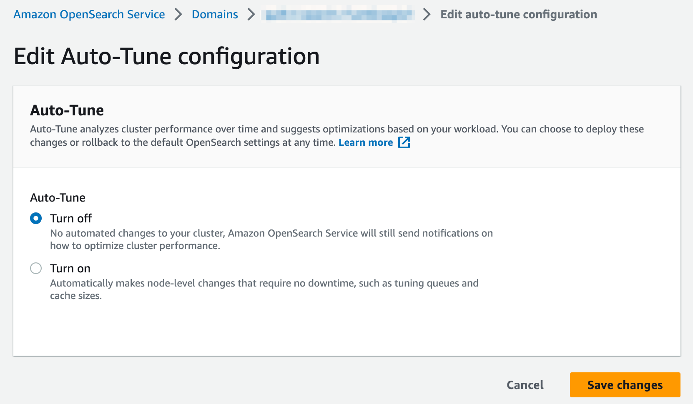

<!-- markdownlint-disable -->

Each Quilt stack includes an Elasticsearch cluster that indexes
objects and packages as documents. The cluster is deployed in the
AWS OpenSearch service. You can connect to your Elasticsearch
domain to query documents.

> If your Quilt stack uses private endpoints for Elasticsearch you will need to
> connect to the cluster from a machine in the same VPC as the cluster.

Each Amazon S3 bucket connected to Quilt implies two Elasticsearch index aliases:
1. `YOUR_BUCKET_NAME`: Contains one document per object in the bucket.
2. `YOUR_BUCKET_NAME_packages`: Contains one document per package revision in the bucket.

> Quilt uses Amazon Elasticsearch version 6.7.

## Query Elasticsearch with Python

You can use [`elasticsearch
6.3.1`](https://elasticsearch-py.readthedocs.io/en/6.3.1/) as
follows:

<!--pytest.mark.skip-->
```python
from aws_requests_auth.boto_utils import BotoAWSRequestsAuth
from elasticsearch import Elasticsearch, RequestsHttpConnection

es_host = "check.aws.console.for.your.host.us-east-1.es.amazonaws.com"

auth = BotoAWSRequestsAuth(
    aws_host=es_host,
    aws_region='us-east-1',
    aws_service='es'
)

elastic = Elasticsearch(
    hosts=[
        {"host": f"{es_host}", "port": 443}
    ],
    http_auth=auth,
    use_ssl=True,
    verify_certs=True,
    connection_class=RequestsHttpConnection,
    timeout=27
)

query = rbody = {
    "query": {
        # query body here
    }
}

elastic.search(
    index="*_packages", # search all package indexes in this stack
    body=rbody,
    _source=['*'], # return all document fields
    size=1000,
)
```

## Monitoring your Elasticsearch cluster

It's helpful to periodically review the Quilt Elasticsearch cluster
health to ensure performance is optimal and cost-effective.

To review your Elasticsearch cluster:

1. In CloudFormation, select your Quilt stack.
1. In the "Resources" tab, type `AWS::Elasticsearch::Domain`. There
will be one result (`Logical ID` value of `Search`).
1. Click the link in the `Physical ID` column to access the Quilt
Elasticsearch cluster in the AWS OpenSearch service.
1. Select the "Cluster health" tab.
1. Review the "Summary" section (look for **Green** Status):
   - If your cluster Status is **Red** or **Yellow**, notify your Quilt account manager.
1. In the "Overall health" section, update the "Time range" to `2w`
and review all graphs, paying particular attention to:
    - Total free storage space: if one or more nodes in your cluster
    has storage space less than the minimum value of either 20% of
    available storage space or 20GB of storage space, basic operations
    (adding documents; creating indexes) can start to fail. Notify your
    Quilt account manager.
    - Searchable documents: if the total number of searchable documents
    remains static or reduces but you are adding documents to Quilt,
    notify your Quilt account manager.
1. In the "Key performance indicators" section, update the "Time
range" to `2w` and review all graphs, paying particular attention
to:
    - HTTP requests by response code: Excessive 4xx or 5xx HTTP
    response codes can indicate problems with your cluster
    configuration.

> Data from the Quilt Elasticsearch cluster is published to Amazon
Cloudwatch and retained for two weeks before being discarded. The
charts listed above are created from raw data in Cloudwatch. Depending
on your needs, you may wish to view cluster data in CloudWatch
directly.

### References

- [Sizing Amazon OpenSearch Service
domains](https://docs.aws.amazon.com/opensearch-service/latest/developerguide/sizing-domains.html)

## Auto-Tune and CloudFormation

Auto-Tune is a feature of the Amazon OpenSearch service that analyzes
cluster performance over time and suggests optimizations based on
workload. There is known bug in CloudFormation when deploying and/or
upgrading Quilt stacks using t2 or t3 instance types. During stack
deployments the following error may be encountered:

```
Autotune is not supported in t2/t3 instance types.
Disable autotune or change your instance type.
(Service: AWSElasticsearch; Status Code: 400; Error Code: ValidationException;
Request ID: XXXXXXXX-XXXX-XXXX-XXXX-XXXXXXXXXXXX; Proxy: null)
```

This is due to CloudFormation turning Auto-Tune on by default. There
is currently no way to modify Auto-Tune configurations using
CloudFormation. Your Quilt administrator will need to take the following
actions and re-run the Quilt CloudFormation deployment:

1. Access the Quilt OpenSearch cluster (see steps 1 - 3 above).
1. Select the "Auto-Tune" tab.
1. Review the "Status" value. If the value is **Turned on**, click the "Edit" button.
1. Select the option to "Turn off" Auto-Tune and click the "Save changes" button:


