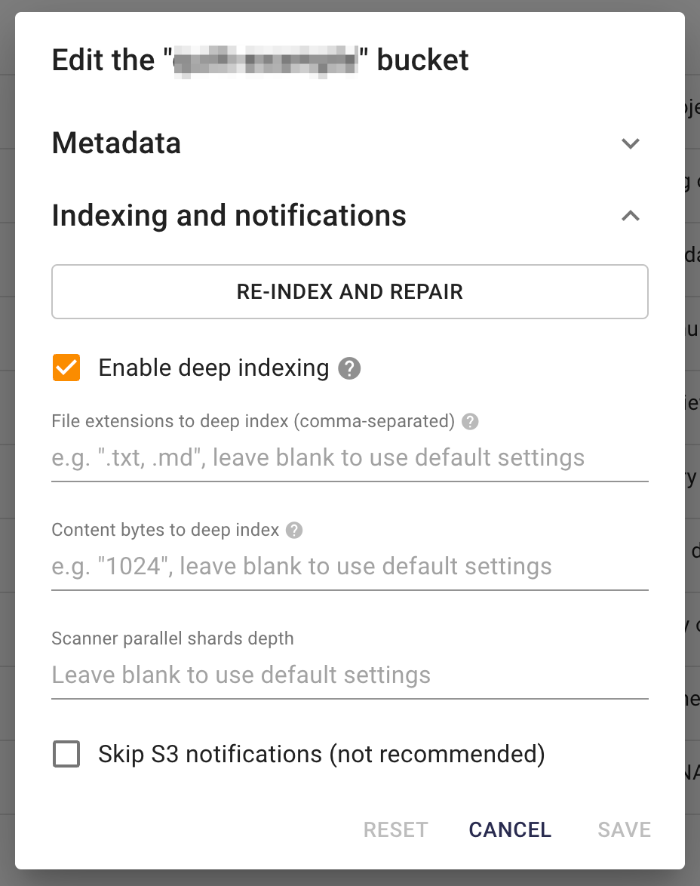

# Working with Elasticsearch in Quilt

This comprehensive guide covers Elasticsearch integration, advanced querying
techniques, monitoring, and optimization strategies for Quilt deployments.
Learn to leverage the full power of search and analytics in your data catalog.

## 📋 Table of Contents

- [Elasticsearch Fundamentals](#elasticsearch-fundamentals)
- [Index Structure and Schema](#index-structure-and-schema)
- [Query Configuration](#query-configuration)
- [Python Integration](#python-integration)
- [Advanced Search Patterns](#advanced-search-patterns)
- [Performance Monitoring](#performance-monitoring)
- [Cluster Management](#cluster-management)
- [Best Practices](#best-practices)
- [Troubleshooting](#troubleshooting)

## 🔍 Elasticsearch Fundamentals

Each Quilt stack includes an Elasticsearch cluster that indexes objects and
packages as searchable documents. The cluster is deployed using AWS OpenSearch
service, providing enterprise-grade search capabilities with high availability
and security.

## 📊 Index Structure and Schema

### Index Organization

Each S3 bucket connected to Quilt creates two Elasticsearch index aliases:

| Index Type | Alias Pattern | Content | Use Case |
|------------|---------------|---------|----------|
| **Object Index** | `YOUR_BUCKET_NAME` | One document per S3 object | File-level search, content discovery |
| **Package Index** | `YOUR_BUCKET_NAME_packages` | One document per package revision | Package-level search, version tracking |

### Document Schema Examples

**Object Document Structure:**

```json
{
  "key": "data/sales/2024/q3_sales.csv",
  "size": 2048576,
  "last_modified": "2024-08-26T10:30:00Z",
  "content_type": "text/csv",
  "user_meta": {
    "department": "sales",
    "quarter": "Q3",
    "year": "2024"
  },
  "comment": "Q3 sales data with regional breakdowns",
  "version_id": "abc123def456"
}
```

**Package Document Structure:**

```json
{
  "name": "sales-team/q3-analysis",
  "top_hash": "a1b2c3d4e5f6",
  "created": "2024-08-26T10:30:00Z",
  "author": "data-team@company.com",
  "message": "Q3 sales analysis with forecasting models",
  "metadata": {
    "description": "Comprehensive Q3 sales analysis",
    "tags": ["sales", "analysis", "q3-2024"],
    "version": "2.1.0"
  },
  "entries": 15,
  "total_size": 52428800
}
```

## ⚙️ Query Configuration

### Saved Query Management

Provide pre-configured queries for your users through YAML configuration:

```yaml
# s3://YOUR_BUCKET/.quilt/queries/config.yaml
version: "1"
queries:
  sales-data-search:
    name: "Sales Data Search"
    description: "Find sales data by department and time period"
    url: s3://BUCKET/.quilt/queries/sales-search.json
  
  large-files:
    name: "Large Files (>100MB)"
    description: "Find files larger than 100MB"
    url: s3://BUCKET/.quilt/queries/large-files.json
  
  recent-packages:
    name: "Recent Packages"
    description: "Packages created in the last 30 days"
    url: s3://BUCKET/.quilt/queries/recent-packages.json
```

### Query Examples

**Sales Data Search Query:**

```json
{
  "query": {
    "bool": {
      "must": [
        {
          "match": {
            "user_meta.department": "sales"
          }
        },
        {
          "range": {
            "last_modified": {
              "gte": "2024-07-01",
              "lte": "2024-09-30"
            }
          }
        }
      ]
    }
  },
  "sort": [
    {
      "last_modified": {
        "order": "desc"
      }
    }
  ]
}
```

**Large Files Query:**

```json
{
  "query": {
    "range": {
      "size": {
        "gte": 104857600
      }
    }
  },
  "sort": [
    {
      "size": {
        "order": "desc"
      }
    }
  ],
  "_source": ["key", "size", "last_modified", "content_type"]
}
```

### Query Categories

Organize queries by use case:

| Category | Purpose | Example Queries |
|----------|---------|-----------------|
| **Content Discovery** | Find specific file types or content | CSV files, images, models |
| **Size Management** | Identify large files or storage usage | Files >100MB, total size by department |
| **Temporal Analysis** | Time-based searches | Recent files, quarterly data |
| **Metadata Searches** | Custom metadata queries | By author, project, or tags |
| **Package Analytics** | Package-level insights | Popular packages, version history |

## Managing Elasticsearch

<!-- markdownlint-disable-next-line MD013 -->
Quilt uses Amazon Elasticsearch 6.7
([docs](https://www.elastic.co/guide/en/elasticsearch/reference/6.7/index.html)).

1. If your Quilt stack uses private endpoints for Elasticsearch you will need to
   connect to the cluster from a machine in the same VPC as the cluster.
2. By default, Quilt indexes a limited number of bytes per document for
specified file formats (100KB). Both the max number of bytes per document and
which file formats to deep index can be customized per Bucket in the Catalog
Admin settings.

<!-- markdownlint-disable-next-line MD013 -->


## Querying Elasticsearch with Python

You can use [`elasticsearch`](https://elasticsearch-py.readthedocs.io/en/) as
follows:

<!--pytest.mark.skip-->
```python
from aws_requests_auth.boto_utils import BotoAWSRequestsAuth
from elasticsearch import Elasticsearch, RequestsHttpConnection

es_host = "check.aws.console.for.your.host.us-east-1.es.amazonaws.com"

auth = BotoAWSRequestsAuth(
    aws_host=es_host,
    aws_region='us-east-1',
    aws_service='es'
)

elastic = Elasticsearch(
    hosts=[
        {"host": f"{es_host}", "port": 443}
    ],
    http_auth=auth,
    use_ssl=True,
    verify_certs=True,
    connection_class=RequestsHttpConnection,
    timeout=27
)

query = rbody = {
    "query": {
        # query body here
    }
}

elastic.search(
    index="*_packages", # search all package indexes in this stack
    body=rbody,
    _source=['*'], # return all document fields
    size=1000,
)
```

### Advanced Python Integration

Enhanced Elasticsearch integration with error handling and optimization:

```python
from aws_requests_auth.boto_utils import BotoAWSRequestsAuth
from elasticsearch import Elasticsearch, RequestsHttpConnection
import json
import logging

class QuiltElasticsearchClient:
    """Enhanced Elasticsearch client for Quilt operations."""
    
    def __init__(self, es_host, region='us-east-1'):
        self.es_host = es_host
        self.region = region
        self.client = self._create_client()
    
    def _create_client(self):
        """Create authenticated Elasticsearch client."""
        auth = BotoAWSRequestsAuth(
            aws_host=self.es_host,
            aws_region=self.region,
            aws_service='es'
        )
        
        return Elasticsearch(
            hosts=[{"host": self.es_host, "port": 443}],
            http_auth=auth,
            use_ssl=True,
            verify_certs=True,
            connection_class=RequestsHttpConnection,
            timeout=30,
            max_retries=3,
            retry_on_timeout=True
        )
    
    def search_objects(self, bucket_name, query, size=100):
        """Search objects in a specific bucket."""
        index_name = bucket_name.replace('s3://', '').replace('/', '-')
        
        try:
            response = self.client.search(
                index=index_name,
                body=query,
                size=size,
                _source_excludes=['content']  # Exclude large content fields
            )
            
            return {
                'total': response['hits']['total']['value'],
                'results': response['hits']['hits'],
                'took': response['took']
            }
            
        except Exception as e:
            logging.error(f"Search failed: {e}")
            return {'total': 0, 'results': [], 'error': str(e)}
    
    def search_packages(self, bucket_name, query, size=50):
        """Search packages in a specific bucket."""
        index_name = f"{bucket_name.replace('s3://', '').replace('/', '-')}_packages"
        
        try:
            response = self.client.search(
                index=index_name,
                body=query,
                size=size
            )
            
            return {
                'total': response['hits']['total']['value'],
                'packages': [hit['_source'] for hit in response['hits']['hits']],
                'took': response['took']
            }
            
        except Exception as e:
            logging.error(f"Package search failed: {e}")
            return {'total': 0, 'packages': [], 'error': str(e)}
    
    def aggregate_by_field(self, bucket_name, field, size=10):
        """Get aggregations by a specific field."""
        index_name = bucket_name.replace('s3://', '').replace('/', '-')
        
        agg_query = {
            "size": 0,
            "aggs": {
                "field_values": {
                    "terms": {
                        "field": f"{field}.keyword",
                        "size": size
                    }
                }
            }
        }
        
        try:
            response = self.client.search(index=index_name, body=agg_query)
            buckets = response['aggregations']['field_values']['buckets']
            
            return {
                'field': field,
                'values': [(bucket['key'], bucket['doc_count']) for bucket in buckets]
            }
            
        except Exception as e:
            logging.error(f"Aggregation failed: {e}")
            return {'field': field, 'values': [], 'error': str(e)}

# Example usage
es_client = QuiltElasticsearchClient("your-es-host.us-east-1.es.amazonaws.com")

# Search for CSV files
csv_query = {
    "query": {
        "match": {
            "content_type": "text/csv"
        }
    }
}

results = es_client.search_objects("s3://your-bucket", csv_query)
print(f"Found {results['total']} CSV files")

# Get file type distribution
file_types = es_client.aggregate_by_field("s3://your-bucket", "content_type")
for file_type, count in file_types['values']:
    print(f"{file_type}: {count} files")
```

## Monitoring your Elasticsearch cluster

It's helpful to periodically review the Quilt Elasticsearch cluster
health to ensure performance is optimal and cost-effective.

To review your Elasticsearch cluster:

1. In CloudFormation, select your Quilt stack.
1. In the "Resources" tab, type `AWS::Elasticsearch::Domain`. There
will be one result (`Logical ID` value of `Search`).
1. Click the link in the `Physical ID` column to access the Quilt
Elasticsearch cluster in the AWS OpenSearch service.
1. Select the "Cluster health" tab.
1. Review the "Summary" section (look for **Green** Status):
   - If your cluster Status is **Red** or **Yellow**, notify your Quilt account
     manager.
1. In the "Overall health" section, update the "Time range" to `2w`
and review all graphs, paying particular attention to:
    - Total free storage space: if one or more nodes in your cluster
    has storage space less than the minimum value of either 20% of
    available storage space or 20GB of storage space, basic operations
    (adding documents; creating indexes) can start to fail. Notify your
    Quilt account manager.
    - Searchable documents: if the total number of searchable documents
    remains static or reduces but you are adding documents to Quilt,
    notify your Quilt account manager.
1. In the "Key performance indicators" section, update the "Time
range" to `2w` and review all graphs, paying particular attention
to:
    - HTTP requests by response code: Excessive 4xx or 5xx HTTP
    response codes can indicate problems with your cluster
    configuration.

> Data from the Quilt Elasticsearch cluster is published to Amazon
Cloudwatch and retained for two weeks before being discarded. The
charts listed above are created from raw data in Cloudwatch. Depending
on your needs, you may wish to view cluster data in CloudWatch
directly.

### References

<!-- markdownlint-disable-next-line MD013 -->
- [Sizing Amazon OpenSearch Service
domains](https://docs.aws.amazon.com/opensearch-service/latest/developerguide/sizing-domains.html)

## Auto-Tune and CloudFormation

Auto-Tune is a feature of the Amazon OpenSearch service that analyzes
cluster performance over time and suggests optimizations based on
workload. There is known bug in CloudFormation when deploying and/or
upgrading Quilt stacks using t2 or t3 instance types. During stack
deployments the following error may be encountered:

```log
Autotune is not supported in t2/t3 instance types.
Disable autotune or change your instance type.
(Service: AWSElasticsearch; Status Code: 400; Error Code: ValidationException;
Request ID: XXXXXXXX-XXXX-XXXX-XXXX-XXXXXXXXXXXX; Proxy: null)
```

This is due to CloudFormation turning Auto-Tune on by default. There
is currently no way to modify Auto-Tune configurations using
CloudFormation. Your Quilt administrator will need to take the following
actions and re-run the Quilt CloudFormation deployment:

1. Access the Quilt OpenSearch cluster (see steps 1 - 3 above).
1. Select the "Auto-Tune" tab.
1. Review the "Status" value. If the value is **Turned on**, click the "Edit"
   button.
1. Select the option to "Turn off" Auto-Tune and click the "Save changes"
   button:


