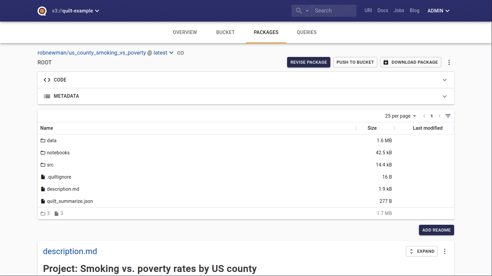

# Working with the Quilt Catalog

This comprehensive guide covers the Quilt Catalog's advanced features, customization options, and enterprise deployment strategies. Learn to maximize your data catalog's impact across your organization.

## 📋 Table of Contents

- [Catalog Fundamentals](#catalog-fundamentals)
- [Navigation and Discovery](#navigation-and-discovery)
- [Advanced Search Features](#advanced-search-features)
- [Package Management Interface](#package-management-interface)
- [Visualization and Dashboards](#visualization-and-dashboards)
- [Administration and Governance](#administration-and-governance)
- [Customization and Branding](#customization-and-branding)
- [Integration Patterns](#integration-patterns)
- [Best Practices](#best-practices)

## 🏛️ Catalog Fundamentals

The Quilt Catalog is the web-based interface that transforms your S3 bucket into a comprehensive data catalog. It provides enterprise-grade features for data discovery, collaboration, and governance while maintaining seamless integration with the Quilt Python API.

**🚀 [Explore the live demo catalog](https://open.quiltdata.com/b/quilt-example)**

### Architecture Overview

The catalog operates as a web application that:
- **Indexes** your S3 data using Elasticsearch
- **Visualizes** package contents and metadata
- **Enables** collaborative data workflows
- **Provides** search and discovery capabilities
- **Supports** custom branding and workflows

**Note**: While you can use the Quilt Python API independently, the catalog and API are designed to work together for maximum effectiveness.

## 🧭 Navigation and Discovery

### Homepage Customization

Create a welcoming data catalog experience with a custom homepage:

```markdown
<!-- s3://your-bucket/README.md -->
# Welcome to Our Data Catalog

## 🎯 Quick Start
- **New Users**: Start with our [Getting Started Guide](./docs/getting-started.md)
- **Data Scientists**: Explore our [ML Datasets](./packages/ml-datasets/)
- **Analysts**: Check out [Business Intelligence Data](./packages/bi-data/)

## 📊 Featured Datasets
- **Customer Analytics**: Latest customer behavior insights
- **Sales Performance**: Q3 2024 sales data and forecasts
- **Market Research**: Industry trends and competitive analysis

## 🔗 Resources
- [Data Dictionary](./docs/data-dictionary.md)
- [Best Practices](./docs/best-practices.md)
- [Support Portal](https://support.company.com/data)
```

### Multi-Tab Navigation

The catalog provides three primary navigation modes:

| Tab | Purpose | Best For |
|-----|---------|----------|
| **📦 Packages** | Curated data collections | Versioned datasets, analysis projects |
| **📁 Bucket** | Raw S3 object browser | Individual files, ad-hoc exploration |
| **🔍 Search** | Global content discovery | Finding specific data across all sources |

### Package Discovery Patterns

**Hierarchical Browsing:**
- Navigate by namespace: `company/department/project`
- Filter by tags: `#quarterly`, `#ml-ready`, `#confidential`
- Sort by: creation date, size, popularity

**Smart Filtering:**
```javascript
// Example catalog URL patterns
https://catalog.company.com/b/data-bucket/packages?
  namespace=marketing&
  tags=quarterly,customer-analysis&
  sort=created_desc&
  size_min=1MB
```

### Search

Catalogs also enable you to search the contents of your bucket. We support both
unstructured (e.g. "`San Francisco`") and structured with
[Query String Queries](https://www.elastic.co/guide/en/elasticsearch/reference/6.7/query-dsl-query-string-query.html#query-string-syntax)
(e.g. "`metadata_key: metadata_value`") search. Hits are previewed right in the
search results.


### Upload package

You can upload a new package providing the name of the package, commit message,
files, metadata, and [workflow](../advanced-features/workflows.md).

The name should have the format `namespace/package-name`.

The message needs to add notes on a new revision for this package.

Files are the content of your package.

The associated workflow contains the rules for validating your package.

The metadata can be added with the JSON editor for both packages and individual file
entries within a package, represented as a key/value table with infinite
nesting. If your workflow contains a JSON schema, you will have predefined key/value
pairs based on the schema.

#### JSON editor

To add a new key/value field double click on an empty cell and type the key name,
then press "Enter" or "Tab", or click outside of the cell. To change the value
double click on that value.

Values can be strings, numbers, arrays, or objects. Every value that you type
will be parsed as JSON.

> Limitations
>
> * References and compound types are not currently supported.

### Push to bucket

You can push an existing data package from one S3 bucket to another. To use this
feature consult the [Workflows](../advanced-features/workflows.md) page.

### Summarize

Adding a `quilt_summarize.json` file to a data package (or S3 directory path)
will enable content preview right on the landing page.

See [Visualization & dashboards documentation](../Catalog/VisualizationDashboards.md#quilt_summarize.json)
for details.



## Admin UI

The Quilt Catalog includes an Admin panel where you can manage users and
buckets in your stack and customize the display of your Quilt Catalog.
See [Admin UI docs](../Catalog/Admin.md) for details.

**[To learn more, check out the public demo catalog](https://open.quiltdata.com/b/quilt-example)**.
