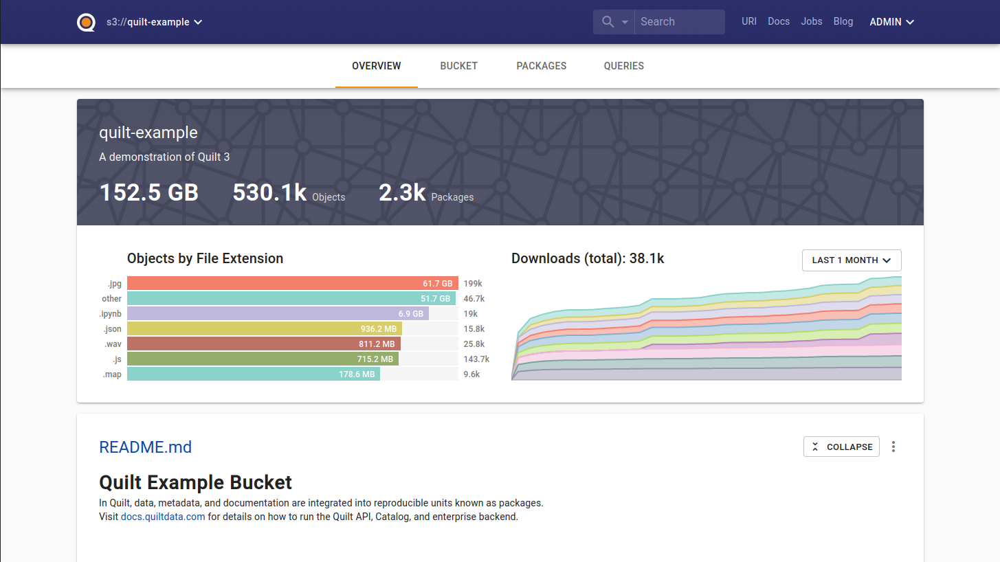
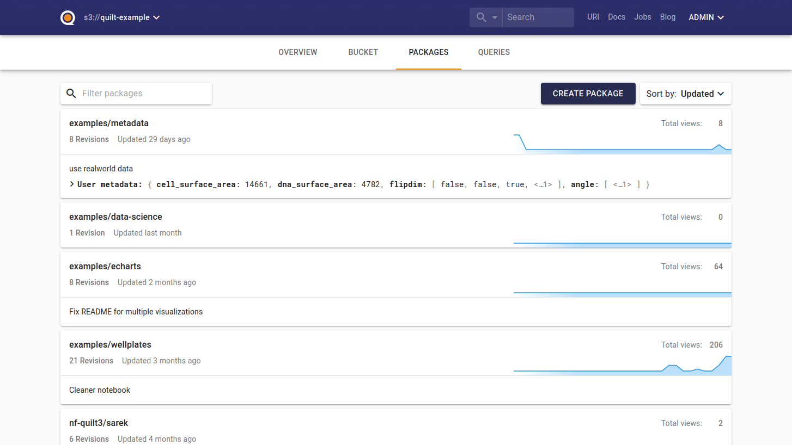

<!-- markdownlint-disable-next-line first-line-h1 -->
The Quilt Catalog is the second half of Quilt. It provides an interface on top
of your S3 bucket that brings Quilt features like data packages and search to
the web.

**[For a hands-on demo, check out the public demo catalog](https://open.quiltdata.com/b/quilt-example).**

Note that you can use the Quilt Python API without using the Quilt Catalog,
but they are designed to work together.

## Brief tour

The Quilt Catalog provides a homepage for your data catalog, based on a `README.md`
file that you can optionally create at the top of your bucket.

### Browse

The Catalog lets you navigate packages in the registry using the "Packages" tab.

You can also browse the underlying S3 files using the "Bucket" tab.

### Search

Catalogs also enable you to search the contents of your bucket. We support both
unstructured (e.g. "`San Francisco`") and structured with
[Query String Queries](https://www.elastic.co/guide/en/elasticsearch/reference/6.7/query-dsl-query-string-query.html#query-string-syntax)
(e.g. "`metadata_key: metadata_value`") search. Hits are previewed right in the
search results.

### Upload package

You can upload a new package providing the name of the package, commit message,
files, metadata, and [workflow](../advanced-features/workflows.md).

The name should have the format `namespace/package-name`.

The message needs to add notes on a new revision for this package.

Files are the content of your package.

The associated workflow contains the rules for validating your package.

The metadata can be added with JSON editor, represented as a key/value table
with infinite nesting. If workflow contains JSON schema, you will have
predefined key/value pairs according to the schema.

#### JSON editor

To add a new key/value field double click on an empty cell and type key name,
then press "Enter" or "Tab", or click outside of the cell. To change value
double click on that value.

Values can be strings, numbers, arrays, or objects. Every value that you type
will be parsed as JSON.

We don't support references and compound types yet.

### Push to bucket

You can push the existing package from one bucket to another. To use this
feature consult [workflows](../advanced-features/workflows.md) page.

### Summarize

Adding a `quilt_summarize.json` file to a data package (or S3 directory path)
will enable content preview right on the landing page.

See [Visualization & dashboards docs](../Catalog/VisualizationDashboards.md#quilt_summarize.json)
for details.

## Admin UI

The Quilt catalog includes an admin panel that allows you to manage users and
buckets in your stack and to customize your Quilt catalog.
See [Admin UI docs](../Catalog/Admin.md) for details.

**[To learn more, check out the public demo catalog](https://open.quiltdata.com/b/quilt-example)**.
